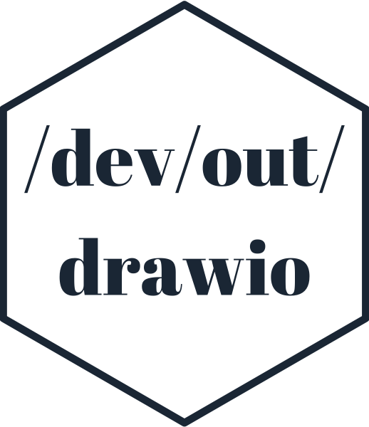
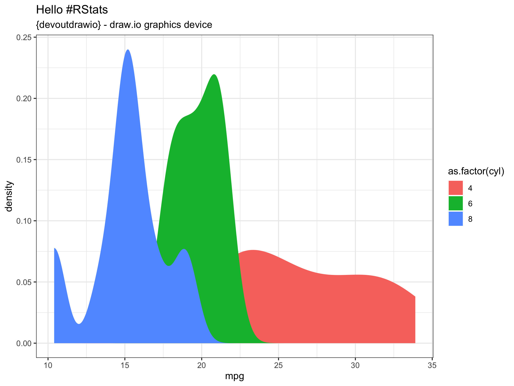
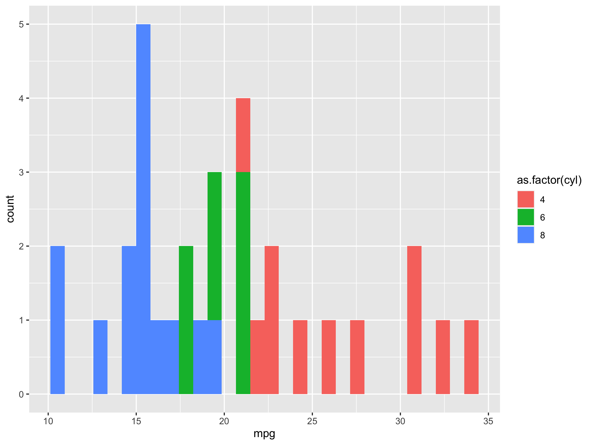
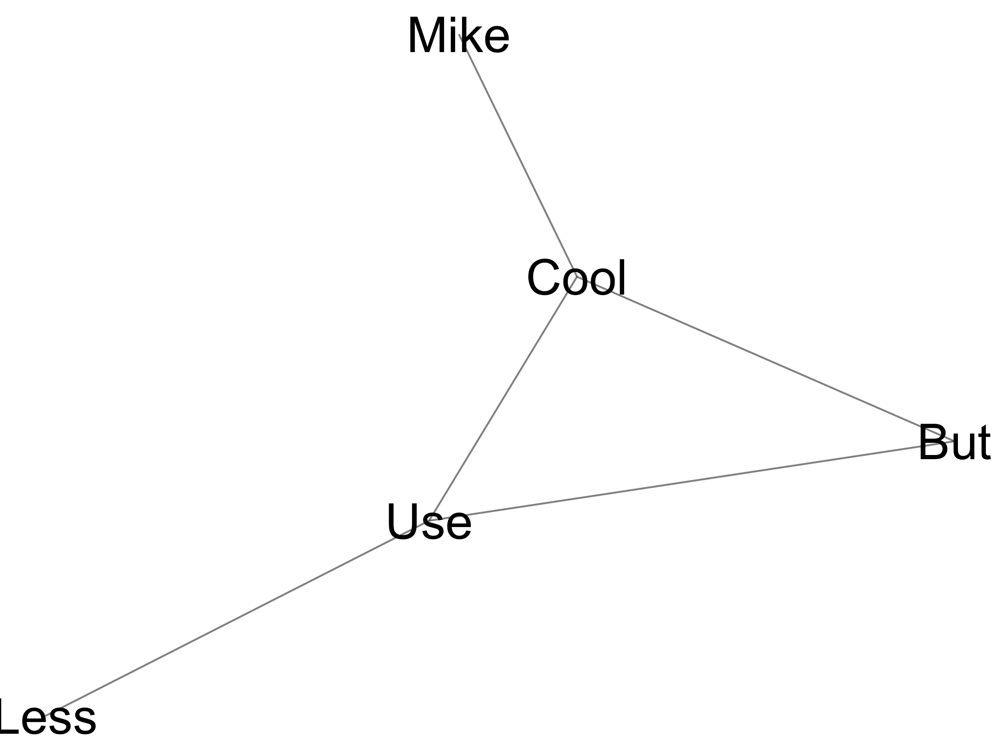
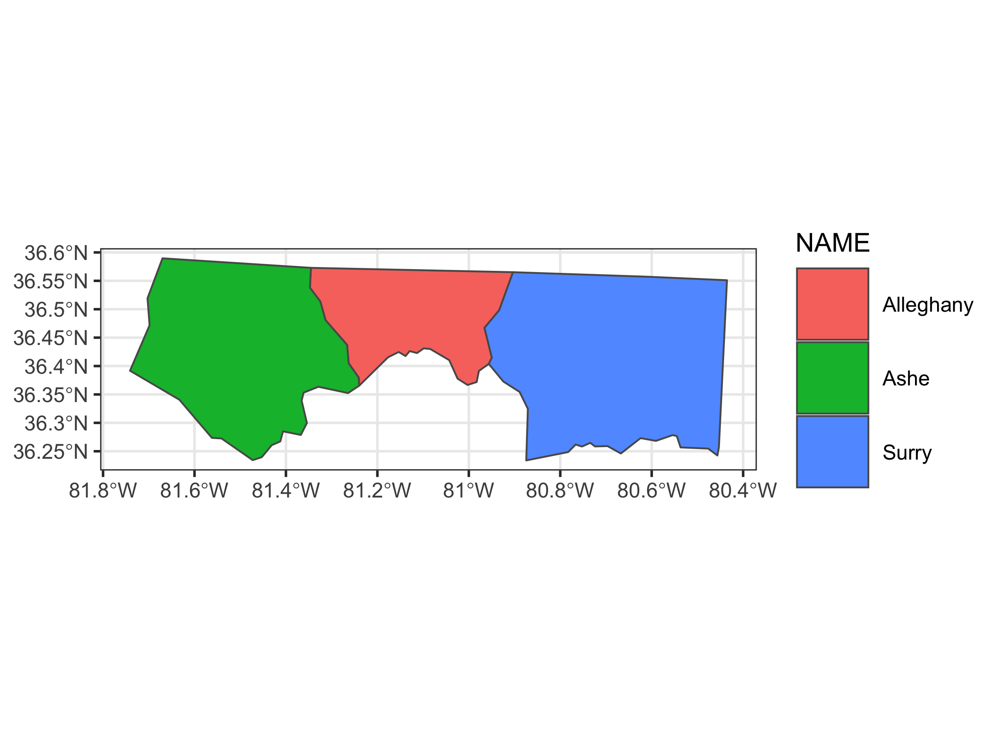
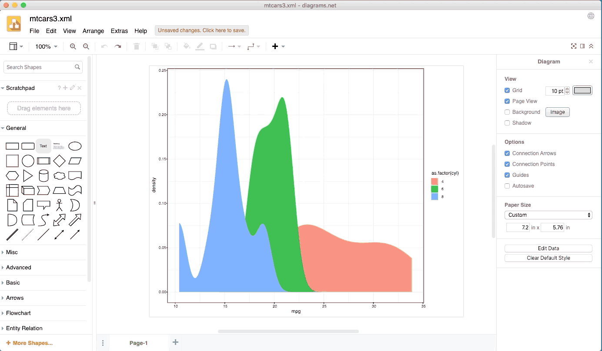
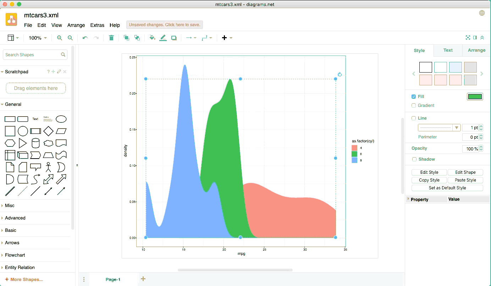

<!-- README.md is generated from README.Rmd. Please edit that file -->

```{r, include = FALSE}
knitr::opts_chunk$set(
  collapse = TRUE,
  comment = "#>",
  fig.path = "man/figures/README-",
  out.width = "100%"
)


library(knitr)
library(ggplot2)
library(minidrawio)
library(devout)
library(devoutdrawio)

set.seed(1)
```


```{r echo = FALSE, eval = FALSE}
# Quick logo generation. Borrowed heavily from Nick Tierney's Syn logo process
library(magick)
library(showtext)
font_add_google("Abril Fatface", "gf")


# pkgdown::build_site(override = list(destination = "../coolbutuseless.github.io/package/devout"))
```


```{r echo = FALSE, eval = FALSE}
img <- image_read("man/figures/white.png")


hexSticker::sticker(subplot  = img,
                    s_x      = 0.92,
                    s_y      = 1,
                    s_width  = 1.5,
                    s_height = 0.95,
                    package  = "/dev/out/\ndrawio",
                    p_x      = 1,
                    p_y      = 1,
                    p_color  = "#223344",
                    p_family = "gf",
                    p_size   = 9,
                    h_size   = 1.2,
                    h_fill   = "#ffffff",
                    h_color  = "#223344",
                    filename = "man/figures/logo.png")

image_read("man/figures/logo.png")
```

# devoutdrawio   

<!-- badges: start -->


<!-- badges: end -->


`drawio` is an open source web and desktop application for creating and editing structured
diagrams.

`devoutdrawio` is a new graphics output device for R which will output graphics
in the drawio XML format suitable for editing in [drawio](http://draw.io).

#### Why drawio?

`drawio` allows you to quickly edit structured documents online for free.  By 
outputting in a format suitable for drawio, you can output graphics from R
and then manually edit individual elements, lines and polygons to suite your 
needs.

## Installation

You can install from [GitHub](https://github.com/coolbutuseless/devoutdrawio) with:

``` r
# install.packages("remotes")
remotes::install_github("coolbutuseless/devout")       # devout framework
remotes::install_github("coolbutuseless/minidrawio")   # draw.io doc creator
remotes::install_github("coolbutuseless/devoutdrawio") # this device
```


#### Limitations

* No current support for clipping paths or rasters.
* Text positioning and spacing is still a little off
* Rotated text (except for 0 and 90 degrees) is probably going to be placed incorrectly.
* No code has been written to handle changes to the font family so you're stuck with helvetica for now. 


# Basic Usage

Use `devoutdrawio::drawio` as you would the `pdf()` or `png()` device.

The output will be written to an XML file in the draw.io format.

You can then load this into the [draw.io web app](draw.io).


```{r eg1, out.width="50%"}
#~~~~~~~~~~~~~~~~~~~~~~~~~~~~~~~~~~~~~~~~~~~~~~~~~~~~~~~~~~~~~~~~~~~~~~~~~~~~~
# PNG output of plot
#~~~~~~~~~~~~~~~~~~~~~~~~~~~~~~~~~~~~~~~~~~~~~~~~~~~~~~~~~~~~~~~~~~~~~~~~~~~~~
p <- ggplot(mtcars) +
    geom_density(aes(mpg, fill = as.factor(cyl)), colour = NA) +
    theme_bw() +
    labs(title = "Hello #RStats", subtitle = "{devoutdrawio} - draw.io graphics device")
  print(p)
#~~~~~~~~~~~~~~~~~~~~~~~~~~~~~~~~~~~~~~~~~~~~~~~~~~~~~~~~~~~~~~~~~~~~~~~~~~~~~
# Save to drawio XML format
#~~~~~~~~~~~~~~~~~~~~~~~~~~~~~~~~~~~~~~~~~~~~~~~~~~~~~~~~~~~~~~~~~~~~~~~~~~~~~
drawio("man/figures/mtcars.xml")
print(p)
invisible(dev.off())
```


# Examples: click to view and edit on draw.io

Click on an image to take you to a draw.io preview page. At the bottom of
that page, click on the pencil icon to edit the image in the draw.io web app.

The XML draw.io plots can be downloaded from here: 
[1](man/figures/mtcars.xml),
[2](man/figures/mtcars2.xml),
[3](man/figures/ggraph-simple.xml),
[4](man/figures/geom-sf.xml)


```{r results='asis', echo=FALSE}
url <- readLines("man/figures/mtcars.url")[[1]]
cat(glue::glue('<div style="width:45%; float: left;"><a href="{url}"></a></div>\n\n'))

url <- readLines("man/figures/mtcars2.url")[[1]]
cat(glue::glue('<div style="width:45%; float: left;"><a href="{url}"></a></div>\n\n'))

url <- readLines("man/figures/ggraph-simple.url")[[1]]
cat(glue::glue('<div style="width:45%; float: left;"><a href="{url}"></a></div>\n\n'))

url <- readLines("man/figures/geom-sf.url")[[1]]
cat(glue::glue('<div style="width:45%; float: left;"><a href="{url}"></a></div>\n\n'))
```


<div style="clear: both;" />


# Editing in drawio - moving, adding text, changing colours

Rather than outputting a plot as an array of pixels, the `devoutdrawio` device
outputs the plot as a collection of geometric elements.

These elements can then be manipulated, resized, deleted or altered, all from 
within the `drawio` web interface.






<div style="clear: both;" />


```{r}
knitr::knit_exit()
```


```{r include=FALSE}
drawio("man/figures/mtcars2.xml")
p <- ggplot(mtcars) +
  geom_histogram(aes(mpg, fill = as.factor(cyl)))
print(p)
dev.off()

drawio("man/figures/mtcars2.xml")
print(p)
dev.off()

ggsave("man/figures/mtcars2.png", p, width = 8, height = 6)
```


```{r include = FALSE}
library(ggraph)
library(tidygraph)
library(dplyr)

set.seed(1)
simple <- create_notable('bull') %>%
  mutate(name = c('But', 'Use', 'Cool', 'Less', 'Mike')) %>%
  activate(edges) %>%
  mutate(type = sample(c('friend', 'foe'), 5, TRUE))

p <- ggraph(simple, layout = 'graphopt') +
  geom_edge_link0(
    alpha = 0.5
  ) +
  # geom_node_point(size = 5) + 
  geom_node_text(aes(label = name), size = 10) + 
  theme_void()

drawio("man/figures/ggraph-simple.xml")
print(p)
dev.off()

ggsave("man/figures/ggraph-simple.png", p, width = 8, height = 6)
```


```{r include = FALSE}
library(dplyr)
library(sf)
library(ggplot2)

set.seed(1)

nc <- sf::st_read(system.file("shape/nc.shp", package = "sf"), quiet = TRUE)
nc <- nc %>% filter(between(CNTY_ID, 1820, 1830))


p <- ggplot(nc) +
  geom_sf(
    aes(
      fill    = NAME
    )
  ) +
  theme_bw(15) +
  theme(legend.key.size = unit(1.5, 'cm'))

drawio("man/figures/geom-sf.xml")
p
dev.off()

ggsave("man/figures/geom-sf.png", p, width = 8, height = 6)
```


