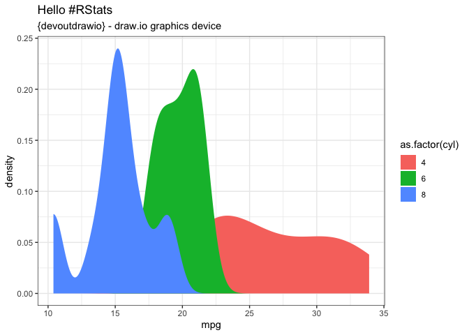

<!-- README.md is generated from README.Rmd. Please edit that file -->

# devoutdrawio 

<!-- badges: start -->


 <!-- badges: end -->

`drawio` is an open source web and desktop application for creating and
editing structured diagrams.

`devoutdrawio` is a new graphics output device for R which will output
graphics in the drawio XML format suitable for editing in
[drawio](http://draw.io).

#### Why drawio?

`drawio` allows you to quickly edit structured documents online for
free. By outputting in a format suitable for drawio, you can output
graphics from R and then manually edit individual elements, lines and
polygons to suite your needs.

## Installation

You can install from
[GitHub](https://github.com/coolbutuseless/devoutdrawio) with:

``` r
# install.packages("remotes")
remotes::install_github("coolbutuseless/devout")       # devout framework
remotes::install_github("coolbutuseless/minidrawio")   # draw.io doc creator
remotes::install_github("coolbutuseless/devoutdrawio") # this device
```

#### Limitations

  - No current support for clipping paths or rasters.
  - Text positioning and spacing is still a little off
  - Rotated text (except for 0 and 90 degrees) is probably going to be
    placed incorrectly.
  - No code has been written to handle changes to the font family so
    you’re stuck with helvetica for now.

# Basic Usage

Use `devoutdrawio::drawio` as you would the `pdf()` or `png()` device.

The output will be written to an XML file in the draw.io format.

You can then load this into the [draw.io web app](draw.io).

``` r
#~~~~~~~~~~~~~~~~~~~~~~~~~~~~~~~~~~~~~~~~~~~~~~~~~~~~~~~~~~~~~~~~~~~~~~~~~~~~~
# PNG output of plot
#~~~~~~~~~~~~~~~~~~~~~~~~~~~~~~~~~~~~~~~~~~~~~~~~~~~~~~~~~~~~~~~~~~~~~~~~~~~~~
p <- ggplot(mtcars) +
    geom_density(aes(mpg, fill = as.factor(cyl)), colour = NA) +
    theme_bw() +
    labs(title = "Hello #RStats", subtitle = "{devoutdrawio} - draw.io graphics device")
  print(p)
```



``` r
#~~~~~~~~~~~~~~~~~~~~~~~~~~~~~~~~~~~~~~~~~~~~~~~~~~~~~~~~~~~~~~~~~~~~~~~~~~~~~
# Save to drawio XML format
#~~~~~~~~~~~~~~~~~~~~~~~~~~~~~~~~~~~~~~~~~~~~~~~~~~~~~~~~~~~~~~~~~~~~~~~~~~~~~
drawio("man/figures/mtcars.xml")
print(p)
invisible(dev.off())
```

# Examples: click to view and edit on draw.io

Click on an image to take you to a draw.io preview page. At the bottom
of that page, click on the pencil icon to edit the image in the draw.io
web app.

The XML draw.io plots can be downloaded from here:
[1](man/figures/mtcars.xml), [2](man/figures/mtcars2.xml),
[3](man/figures/ggraph-simple.xml), [4](man/figures/geom-sf.xml)

<div style="width:45%; float: left;">

<a href="https://app.diagrams.net?lightbox=1&highlight=0000ff&edit=_blank&layers=1&nav=1&title=mtcars.xml#R7LzXsu1IciX4NTSbeZhr0OIRWm1ojTdorTfk1zdwMotkdXHaSFpbV1Z1pjgXJ6BCLHdfy8Nx%2FwVm%2BlNY4qlSxyzv%2FgUCsvNfYPZfIIggiOfn23D91oCBwG8N5VJnvzWB%2F9Zg13f%2Be%2BNfLtvqLF%2F%2F6sLvOHbfevrrxnQchjz9%2FlVbvCzj8deXFWP312%2Bd4jL%2FmwY7jbu%2FbfXr7Fv91opDwL%2B1i3ldVr%2B%2FGcWx30708V%2Bu%2Ff3KtYqz8fh3TTD3LzCzjOP3t6P%2BZPLunbq%2FTMtv9%2FH%2FP2f%2FtV9LPnz%2FMzdkS3zU4%2F%2BnfxV1GZLmt9v3uNt%2BH%2Bjvvfxefxn5Mm5Dlr93A%2F8C00dVf3N7itP37PEs9dNWffvu%2BQ18Dou665ixG5efe2H%2B55%2Bnff0uY5v%2F5cwwDvm%2FNv5lOt%2Fbx%2BfB9feFCAi8b%2Fvbwf0%2B3j1fvvn575p%2BH6yQj33%2BXa7nkuM%2FWKbqP1qi%2BHdolP96779N33Pw%2Bwz%2BL2fTTW7KnZn2n3c2fz%2BLAL9%2Bn7Xf7Rgmf4Eo%2FlvTv5txlCB%2FAQgBIDgBYygI%2FwfTD6C%2FAJJAnisBBAT%2Fty3FPvRHb5j%2FCWA%2Flji9h%2Bs3H9K6%2B3%2BykPywo3qwnGW0EHyriTON9c6ZESVBwhyP8jOD9MaC3NJX3pxsJwoNK5exKsSBusAGA688ndzsABbqmxGoZeJyT08qBBVuwf%2FmCd98HaDwBM%2FLEvlYWNcVwJG%2BLcYRQJ2oUHyY013CqrBAM2w5mV73cQyI1MmBmP77PHswLu6%2BTJK868Hm3waUTvnv6P2%2Ff4OKBy8c%2Ff77N9AAfuEgCIMEQeIYjOMk%2Bj8h7Xc8%2Fc%2FoyeK1%2BgEu%2BPsvRvz95svwe8v%2FJnABAAhAAPIYJ4L%2FFdAQHP6FYDgA4hBJgij834Dc%2Fz6Q1SGlnjsX%2FQmyfy6QPT39RQA4icEITgJ%2FX4zt8b3Gk879ibF%2FLoxBBPQLRJ6oR2Jv7MP%2BriArzjILJS35E2T%2FXCADCezXgzECRQmYwAno7woypbZKo%2Fqcf4LsnwtkJPCLgAHiOfnA7QHa3xVkn%2BLUp%2BPe%2FusgS9znFRY7SgdrXPGeTFt4tMSDK85BOFoSkuhIBMt4iKfvxqz9nIALfwNR5MDDD4lLtiDHGZIGaaxOGA9WjimnYwI1FqAJ3POs%2FXkSmEHJTNt178PAimsocOBW7fSgQlSuuBY6cqvLInyjE%2B9Yp3z64xc0UyI9lKfT85vhkc%2FAaHPIGWffUtuSxOfXotVuL2OIZyz%2FFGADQfTXEx4BBINAAIfJ%2F0BoggAGYghMwOjfgA38P6cx%2Fesoeq8X%2FsTaPyzWHu%2F1C8QeIBHE48egPyzU7E1cvVQc%2F4TaPyzUYAR%2BoPFoShBBcBgA%2F7BY2zjGOG62%2FBNr%2F7BYe1jaLwBGkYe4YQ%2F3%2F%2BP6tWZSmW2brD%2Bx9g%2BLNRQHfpE4CIEY9oRRDP7DYs2mIyXpw%2F%2BGX%2Fu%2FRX%2BCvxAI%2Bg1dEI6i5B8FYv9L%2BYlC4C%2BIxFAEgQASAv8WYv8n5WeYtOunp9Q%2FMfZPhTEEQn89fUZIAH4ztn%2FfPFqing2jD9KfGPunwhj8SFESJ5AHPxhBYsTfFWOUYUhNKlF%2FYuyfCmOPCP0FgyRMQDhCEAjyd8UY1%2Fip4PJ%2F7p7%2Fc2EMhIlfGAbAEEFCBP73DZWp3fGiUmR%2FQuyfCmJvJg0An%2F6CAIGS2N%2FXjcXhx%2F048fRfx9j%2FbSmMPyrWUOIXhAEgQpIAiJJ%2F4GxZUGnaYcr%2FjVqgP6H2x4DaM8G%2FQBIlH0EJkgT%2Bx93bDNg%2Bnx3pP1HK%2FCfU%2FphQgwjsFwiDOPzEPwL8j8q1%2FxhI%2Byx5V9Zx%2FyfS%2FlGRhgDALwDDn07hKIYgf9ydzUnpXNbJqj%2Bh9o8KNRREHuoPwxAA4wj%2Bl4X7A0JtOL%2Bduqn%2FjQTan1D7Y0ANg%2FBfJEyCIESSMAD8cfc19YGW48DT%2F%2BtQGyI4apscTnO%2FqJbseR%2BYoOktBwyLSZJrf1ih42kgws%2B3U194LufREiGPCZwP28RdMjNHNCHEljMDkb79%2Fvlvc%2FffDhZ0wkScPB9w%2FOvJuDB%2BDt6W4Lcm7Lx%2BO0Cx1zfThl%2B8D7hf0GMPReYJ4f2BT3lRPAcw%2FnkWgx%2BL9%2FTw%2FEjUF414rT6tifOeC5r3MUseP6%2Fm2xvP1uMWVBgH9D1AfnsXkRnI%2B8UaT5L7bhS%2FNZLf33uEgi%2FMf%2F9l%2F%2BnNTye730eWv28hk%2BftPE5iOIFv74vep%2BxvX4rCew7F%2BflJ%2B7k19tUsWE%2BL3q2kRP4Mon2eQO8Ovuu3A9Vvh6BEVg3Ysd8R69gn38MgeZ7tO%2Blr42IywUL4HXpiH0Ij0gY%2Fy7AgdvABpc4W%2Fkbbw6D4afKRDIRhJLw%2BH8C8M%2B3Cw%2FRBEq0Ba4%2BzW48%2FswUuX%2BD%2BpHfy0RX8Y0jPjY4o%2BtdCbkCzG%2F6DFR5AgoEco6%2Bq2XfxvW55xZcPNMBoRyRZFWAZCn%2BLQRfi%2Fuov4ZNPdWBEXyHZf1tao2N54HzaGkE03FMlv2jgtKZ7P%2BfW%2B0bDyefeceUe9k7n1KXwpifvi1UK2IvkXb%2Fn%2FwOVrh1t7w22Fk3C69aAjok3iuTHAeHcejwGQYvOTagXaW1Dmg0O9C5iou4KnkaTQG%2Fd9q4cFU0QkHbw8IIuey%2FRBa25CTDZYCRaThD3w6exUgHSOd%2FVh2DpKByyPN6%2B6Jez7mZg7yC0uti6yx8NPd6UG7nbOHiFSQcNSYn160imuI9lHFO82Fr1DCGtI196p35%2Bp0HkHXJ8JucO3e9gU%2FbCoqzHvtHrZO8XLzrhqPpFRj847pSlFIckG6DCwsU87zE5nxprq0AAD41FA29B23OH2FRHr%2FtZ2t5cFz%2BRwb20FLwjviZ%2Fzds%2ByaOsCnAXnEvkl14DHCTQzBbbYKdB7Xt6IEf3WKER0bsaw6WHaCcUTaYSJw4edpt%2BB%2BGBlZiir336GY3BSc%2FNt9qS4lcb8GVKmgYyzjvUFCxb8S3JdzxwqnOTUZ2AO00JLc0nxVpveuPL2lTSbGwM%2BnelEQe5QO3uEtMKOoXRbetVJL0hHLekhngBG%2BhhgNV87gSJt19%2FL6KSx5N84PkNLnLLlrCbNeYItJAOJN7O32tSLHqPAuVSGdrT3Q4Uucsj8GszIvJTo%2B%2B8ZjIQaCL3AkUz2pncURdqlPfUUPaGQifbHQZiVnTr84BTDOspzZPNsN2rgtQYiDzH36Bgtq9iZ4wRNFAUjcJsZDTyghgmdO97e8PmrdZSBdY2SsDSiuHKSVq3bcrjJhKo15e18nov7gUjrWiU41QsVTQQE%2Bs3ccnGgPzYEg3RLCfQ67XR%2B4vkZZIHYxq6bMOcCsIZOHvNe7uKMZ785%2FBdTHHTKIk6pBwKW0P98UuAgJGBPlUy9uPTtqFttSmVFtoPdoa6SHyDMT%2FNGyh9PZUYW%2B3ORQIcuQlzf3XIiZs0pMuKl1cEmw7T1Jc5IXYIM%2BNmfee1Pju1pUJ5s%2FXXkNbXG4cYRYns9M6rhsTsAAv%2B7SYFmn7fedVsggvvcxU97RZyywIaIqzOyHp9LKQNh2U0zVaHG7XTnnKEgUzASUtDlAhGQBbs71tIYAhF4iFGBGkYOZnTR6mseFNBjenlOYY8IhhFP8xwxLr4Vadd9cgdQ9lvrjhrSOTKJWZGDd3PqmgqFLj4y24aJeKZ%2B8YQevoeQgEVyYa9sQZmyx0AENFxgeAgeTRrmIWSwN4otq3zoc1FjtfRpqFnfqLva%2B3eG8IbjP2qVfUdDQj5Zhgo7m61yOzDGsYMsEeZbl5AhmAfMI994pCFwp%2FxbozZHmc1S9vHO9N2Wa1Q%2B5AsXsAEFXzMHX1D6FUtrT5LoEMSAFcYI8Jsyv16VV%2BkvN2Gv2uq9AAfH0vyOjHeMm3RgrKjKKiBJdH8hShCHhrjr6%2FXuCVGOzhflGnqcgQ9pBtKZbpy0pptuBmM0U85oneTX7ZuQrVRaXaG3wRq4fSta%2FaPZloZYHrwXRWS4SWhLibLFLt5YL4BYaU8enB3Stcofhsq3ivhB4i0U5UshbH8wsiAxaWqdB2RTDNdcw3S5nLgQQccDyFIoupBQESXSmxyS2EbXxyglgOOEOzRzR6p4QADNXNMd3DdASY3SXgNS33zZu6bK%2Fi2VEe9LpbW1n7I8QYUfA17Yqf4XS2rr9RQ56Vtw6WGfuebR3MGJLlRW%2Fkp7xBMPtBYmWjp5o%2B6FBZt%2FloQyRXZQbilNOZW2YR9UazhYVYwEgBYkTSRtHigSdA2U9TEp3oD%2FBh%2Bq2F8HOOdOlO%2FVKtLxQ4%2FSAnyrXcnIhdMCV93JVJpv5po8Jr%2B6tm%2Btq6COdvK8RtvqhjjdLrMauowZpBgMiOgj3BYbFuldJhTi8tjP8h1pdZYfKPtJw3L0tRQ9lmC1hqA12zqiO4%2BNsydikoRS0722%2FG9mRaLE4l7GZVaYlEpgNQF1EdsAYzyhJyx3Xc1oQxhXFPBJvP8rnCcajmqeDzsD7Ert555lgJtGXxL66PsAUukHg6MhZItfzcwMioIXEeCpue%2BkGOBqnYU%2B9ClivCZ%2BvpikLipgGg8gMsk6of%2Fhv4L%2F5sqp7wKRpTlCP4wlsaMiT3H1%2F2yg2OS9ddf9NR2We%2BMybck%2BUSeM5wThsWGnGx713le%2BMtaY%2FMjyPjI8YZvB4Nlw8hGhJqdNyxuhb28jjv84B7G19JUAQtmMy0HXeH8WAIPqUoe%2F%2B2a5QWJEVavscW%2BwCY%2F1DXi4Rtp%2BovDgVAO2QApfEHIpKL55l9G%2FGgSXfQIe7QWKfMWBnHPKgMlkquRV10W8z3XvsQd0n61Fo2WivxVJU2NqNeTU0nPWktrbnun0uEGSFfVPcbxBXSscF9SIYSp0Gla4970tLnxsU3VefheRT7eZckaKhV7o%2FZpVHVzU7E%2FUgCQ6irc9roYnSXQX4uT2FbV79LsekSnG2VZtA8dQLKsK2cvPPwlAA6D8vvLq5NVthtjPM7exCg9yyAHIZmK%2FHAAp3TWDbZxVfhZbWyBZTpcJc9KtNLJueIhxUdfoMtaMMjaK2V80xbWuWBgIC20hY%2BsAl8HvO2Iz0vCxJSK9UGvHGQrd64Uxg1d5Cf20aGfLWZChh3PFZfDHyvHdoFEuYhS8gx2w54Ns7ZxGY7hiJ4Q%2BRwQqOGqvn6ZMCjq0UI8n%2FG6eYdqXVW1b5q2ZourUynZZ1c6vbawcu2zgd3p6zjKG8hTlGuWVVfeWIz0%2BfasqMAwfgKadxscwgFJZQgG8jR%2FxliykcDMyTDorPEjM6ni08X2XBwGYIi%2BksQ6k6q4qpdE1WE46rL9in142S7WiES83nrqRT2EhpLWdQAUDB95%2BlSUBkl86jvXeRQDRfcGrE5g1ozq9wxbZmotr9o2Ok3Vs9RakwBhqIysNH%2BedJFxDBfakHDB0gTjRFcmayGH2aOUauqEShzFeGo96kybVVGWBaldQR7IqLNGL%2B26istCiCR6uYdluK4cDTRoKS3ZIOJZ3VL3Tq8xW%2FXcV%2Bhuxpzkqd5P6Wp7kwLH3IlU8Hqd1jpQFKum2cI1a%2F1wBK1dVJ4qDyYmmDcGHFkpo8cB160ZZjL4GRJvPfcDM0izjT7DeTulvTA9ahOAOtLR%2FT1oguE7cbBF9KVHpd%2FlZEPgMVPVMiR5rXpyqQba6rrROl9GGqXA%2FKuOGDDS0pbDhhT4TuPH4TZAIQ%2F9w8bMw1bohVFth%2FOcEsife1S2Ig9P%2B3nHw5lx6nPkxyWVpyBvS0UYuSxwq3fj5aQyDBekqnCEZhftPrR%2BqicuER8UxQv90zrSE4gEieYYWhuQZ0Joug4IFC6qcMiM6rhimiwdrLwflxUO8yvD18qpp4Q92M%2Bw12NZuowd0yU6Ujzl%2B7dyyFgDgJUZiRNj%2Ba%2BPL%2FPeuz%2FE1jvBEI8lIPNyRX0D23JqFUI0Y5DyzH6lGR1V3rfkMZY0mKHcvE4W27OzEPoiRJ4CCsq%2BnxD%2Bxpmo9VUHZ0vd7gYAyDB%2BtDyKegIZDYy9OnNbYQaPukSUeR0OI3WOIy6A8uxyzAxAlqTl%2FbihEsUbqqUVLLqWuCGpJqBGlZ6RT5KNrF7i%2BqNL94D4VtG2sYta0zjNFbWrETp9sBgofcVcjrOrDhOuTnf6MMXE%2BJz7Q%2FzNkw%2B%2FkDRDR16VZs2%2B9mkDNDDHBnGu0ET1RYrxkovcFhVA7Gx%2FEiTVex6TtSwyHupcIq0hcuPAiWW2XLO1LzIFYE6rP2ceqgfKIYVRwJeMkx%2BWTvLQpsIsRIUBLaSBj2gJfXMemWscLsC2apbn4dSlpOgXmz9ezfXFJOzIfir7kd5c543c7qq4maXzyPJoP9rLHc4%2Fa8rgWCcV6MB4o%2BgQEgzruQnfxRy%2BfjEGaAXqgIouLedkTSUsDuogXKZWai%2BC6eR4opPqLCbNEE%2FzSovGfJaMkjUpXw2yJAMksaoQwhUXe7mFyDFvRoQCL7JYAvjGbA2x6JxyXYDDwzS7dp1tJGerUYehNK6PCMTUFH7WFT1RpKggjYYhG357TH4z5HimHK3zqKzFkH279rLHx%2F1SYFhcLX3lVccA2lCdeQZtXzNlOoaLKbxOXa40cycPfHKvkatBECGv5qXk889Ls1sVQe56a%2BvAPQoFeu%2Flu0ISBBl35eAVyDwrn7UNpWDbeQCN0JRkmpWdkRTPHg%2FX0Q8c%2Bfg4%2BXR1QqOTP%2B66TvhXjnzLvZUYGcPK8qBORXBvns6JgA9AsWVonNMyftDpvE6zczMo%2BxLDrO15e%2FCqVxKtJCF%2Bpxz9fMMjQHqPrhR6RKqCjVIXIh518S19WqOFjdI5EYi0eokwzpdev0%2F7xl0JCsUfM9ootKI7rRxNwZoOVsDL5RzUYFijDMSZpfKt%2FVLqqLynSerNVVhrnX3iLHUxmy8Ak6nK0aBBmGuAFsn361svU%2FmZABJ4I%2BdhhcEuJ4UAiVNVTER39yzOB5%2FGUuiY8QjhUQEBhiECfzKDRC9YxoB5wXq8Sh3Ru0hSkHW%2BNEus8LJ2Wk4RNqEg5hLXeP6UUtS9qpYidK82%2FDNbP3kh6Vz%2B3RPKFAj7NF3V9hqeq3tRCJYy4u6HCWS531NT%2BBHpKeNO6xoKKbnl5%2Bks4R%2BPL7fSZ8U5DohOR7EikX6ECWY4txCgGfUwfkbHZJwbFyRjget4%2BSB%2B75%2BbD%2BSyJ3KT43Q%2BrITlaJAc4S19SxBclF59OeUiAlDXx3p54dho3zI6xCY8CS%2FdREUKh0ePkQh4LPn04e%2B9hCW8YNGH%2Banicli08kTwRVzC0%2FLMYmcnEHWMIO%2FlsOXZenX6kUrngLQyucds%2BU5AKg3kO8wm3osN72vJAl9jLCaJKbrJ91opO%2FL1tL1aBMNX71BcH6l1IRT3eSG9WpIMsY7AALf80QM6Nm9CpqsQUKJR4rP1NV77dGLkDj5aq%2BvjTlURI3d3BGFUB3Pzt9N6r1tMh374xFrpPBCG0qS1gFSysx4y6jShrxowbX6xQia5QsGEF8BnVViWy7CQTOmmMaGmGARb8qab8GB5qUjJ5BI3GuHFIUHzcZPFsx3K9RqNzCwUKuvcrIvPOv0ok%2BFN9E4yq6ImUDrhMUY0tYkl8S5ZkKjIYrvNcbpYJwOIYx%2F6QNVRx3Hh8azEY3FXFIOWWvkvkz5fB6nUJaEWnxFButnZm4LtjdLjayB9gnzTbjH13KOcOnMEdhXzXGqfy1Cro6wdxYy1AGMLzfsXAfCcaS4nhSkvWw85h0Ud3fWDrRx15IkQjmxQZYlRW7xVwRJB1LBcmLnwgR41J%2F2J6KzS0X7LXwrZTKk5GquxXY%2F%2F6VwwMJmCGwYCE6SC%2FrjucVwmdcYxc99ti3imSoA3p7Y3ImwWRyvSgl9cWpVA8WhNaLPBkEvp2cqrW5dfGBTeqrse0uuat9lHwSEwQw8xN40QXFm9vQj77pEKn3XQWGOjMbZaGxinAQzmm0xeAyD1qEZlv7K86Q4BFt80raXEkjgyrPWKekKpGizts%2FB%2BJ7l3sWv1Z5HgkIqjR%2FZCm4vn5yiiUQTFWY1Q%2FPWBusebRben1AdHRQClqP7yEKFGkrAlKQcuX5i23wxXgViMus1SN9uDS0jN3t%2FdgCf6Ye7CQD0jFlDILAfJxO8wE8DgMNkPDMiSTORhdJf1yCi5THCwfBRB93CV%2Bjrhu2o4oY%2FCkMouDSCtgp7bRyRLrioQr0UnzZsuZeMhe3cnGkA%2F46Dbb7YWhngvlNsTzXqWOlRQU4VJZ079bdeBXnxkpZS7WaAO9KGsukoqf%2BQYZeECSs%2FXZ0vFuop8I34vZuiSpbEXOUV2CiKc1ggHrQE8LrQaWNL16GGWDjjWmiod%2FxzaIEYTbce86enc0TyC44zVdKzYQNANJghhvDIIzjt%2F8kSYVNZYR82TUNycKVkEhv5stIivSN0%2F0UeLTLYcG7oYZk4ZXYt7NWZtwHqfbbWHgTY82yZKR9s7MueHtJGCwbq%2B5%2FouIJavjJ2%2BHmatMjVYM3XfKL9Pt4m81iV9gJKNrev%2BlglqCUWdabJp4Qn3mgzzqMGW6hbh8CWA8kQCuT7dVWisYhSbSB%2BfipWa3wQ6hdVlHdrsR85SPkX8kAqOxbpxtUnqXiZlyxSuT5wAva6E%2FOM4YuE8sJ5Kkcv4TqViyGarmGOiNA%2FX2lckkesvbHmMkXANr7YcEralPhcovKbZLfXqqq%2BPCjohQWBV6mFM9AdGgj6hJOy60JIAOwt1Z%2BdDs2DrfYIoAgL31civfWQTMKae9GqG6Kt0VYQZWrtZTkKVIB%2FRDWSEaUjSjCaBX71%2BxIxPsgxDYWOglzrBDW6FaoftShxLm%2FpHMY03lcLjrZhO1eM2cFJGPbM6pFJ2hII5aEQsDwNXlNwYx0JLZvO7hi3A96XcqNUs1CYvvcASR%2BrSqY1RGBOlZJ%2Fag2IBv0y7rLN0HpvpaDrLyLY0iYJFSZKYnZqEpNbM2pwSGskCXihY%2BDSTPWrAQP2BHNrKyigZlHTkTQZK7fi1hdzqAnfwz5BmnQkVfrbAqBvJLp00aHNfVXU3DM7FeYvqSq9CBtkMqCt%2BddH47lRcVz9G9SLxtOlYVOar0diJXAQd5gA%2BBIqaWDVw1cdzZ2d1i0w0rucjJQaHJiQRKwcjb%2FOI7q9x%2FklqjA8vw8KbC9eF7Xeof7SVGkbl2CLOQ2xU7Ehd5zs8bsKSJ6QiXtG00Cj1zbEgACTfHvwOZa2Be%2FMfxoirwWbM6rzScCjMD%2Bs6BphaXt614vYJJfzHrptLhYUS%2FjDmz77Ttb3l2UHQktEdUUM4m8txC%2F6lFJ3FmZkjDvn3GyGS24U653K4%2FQHo2zXJoN98VO7D3lKWsq1ttW6dz9DXzvzmDVfXpscjxTiTYw7Nyt%2BggUTBlRPMq0823V5cpfRIasG4T61Dpnqz87GzxeW%2BxOrq%2BFYSjvw8H1cqWVkgeBL7tSr5UnZaRHGRz67czkESjjGfDZNMUH3PQPVp5EjWOOqcyWNmki4XdYLssT5zPWqHwUXqPmJMTSOAWJFFBx8CfpTIqKHWA4Shfywn4jtmIID27on5GJVH%2BDi5pY58M8mUj2Oxn74s9gDamj7aiHp3KNOAtdcEWfnXBlWaV8P9cGQftLfxExs7hoXB0QGXAiYZIw%2FSPBqC5MmCw2KcsgoTU3xQrUwpNqZIkd6PZ1m%2BtUW%2BW4%2F0Z096M4pYhlNTxNZY1I7eXMbgWKosqHK36NUrYnSBGleaGV93JdD9Y1S1CkprZ9rgQWDsw0RzxAz50Bop3KaW7E1FxLYeB8Qr6GKX1nH8Ce0Id0nFhfOlcjU7V82idH49Yuq7NlJE9ciswdpbEYHR9NDsTFhQPMINpU0pk%2Bt9gPWP79mVhSnAdz9J9ydYrYB7pvy7usv4aEjVUWWgnYM%2BU1Wqny21vSRU4gSr1xhtYeTwlmaESeOEcmpanWjkOEYMWNIv%2B6yStLZK5UUly3OE3FNSKvUF2ThqT5ASA8L3oU%2FcaSdz7Qkks0PkRyEq4AMhqJjGtLjZqZTZ0qv4koDWctU9Uf4hriKxZsk4XV0oa2dlyl5b854z5mSUBVYenUj5dcjWZ5Qg64ur5L4TYuz0iYkm95ablHMKYJs9IrKu5ziH61SMyhgNHuWGnDw3ZId51a7fc5BMsDth2a6NvYbAU3inGWj%2FseizEkgwEGtW%2FgBOqWIey2nEm0YVzb19okmXMnpoog9Xdtcp%2BDxUr9UF7SdJ4%2FD0YNBiY1RvOsNLO5U09GoFtFjMDkukRTjqEnPPuqAWXrXIDK2o6k7ThS%2B0jtPaJ3%2BlULcKvg43tnc1fWDwNG1j8hVkzrMLETdPH3nb%2FKRsjqiyA2%2FdJ3QvcUiD5g5DRsEO%2FmQXyhsarpQy8fLxLSI42dUEhv9UCE9Ne%2BWUQWe7ibtMxKnTbpScgYuMnxGMo2hXS3sjsUQA1lyfTWq3dYR%2F2MITkehRxsfvTHxdaxtm6uC4Isxk%2BiqVrnx4Mb%2BZoLaKKi1IZeSG11kLb9LAzr27IuCP2GD3pFTAYxS5FpgaejvrAYVSAJPITXl%2Bl2wMzegEO7OT%2BJqDMKZywjwecIsZUS2yaoTF0HQL%2FJheN90s8nzNkGP4Rl%2B2UpchM06vrdHmVbGZvsPS62UHKc5jsmxqwEh%2Fz1v4iBsXqx8kyV2w5wXJhqTyUTOl1isURWeBMtgW4lL6qSNmHdFx3XQqrn3QzTeBMfA2Mayrd%2BvfNlzcrc%2B7y5mt6Z3GnU3p2KRI5Bk%2Bj4zfuNzHUQi0Ou1ISJkKUXjqAL6Air55BFWnalaXQzGcI2adTZBZeZaqS21TKfJy3ZNVp7qkPZ1iqbCU7CDhIWScX3Yg5bUMKAtt%2BwLziEnKumbXc2y7Ky3YolQTl%2FiA%2BVKri5Qqd56XjSMo%2B1V1ZmEEmDovapfXfWYPnb0pW%2B4GaNTLB%2Bx4mlvPipiQ76llVk%2Bt7Il6KUSUwvBMG4gs26IWmHv5wz5pxI77HMk8CzzEdZPumK0DYqowUfrIZoIym6J2o86BlzdokEjxGih%2BzeS6Zuutxaqe%2BCvokZ0hWMQ1IyFhJa9vHz8FO0nkUn5%2B%2FekEKJw3lnpcrbSjvmSxfnyq1Ut8A1XrEgRepgjb44XkvHIK%2BdUYac8IvvdJm1HFSyGzvODLY5QtkgbV7bLi78mF2hR6uXf16A26aI1L8OyllxqJWg5M5BX1So3dtsBwrhfsTklRlizZoo9jCGPKAWgMviKacPLiDLWsi3QdP54JCpmhWTWsCGtcEU16mXfJfytAvjtDIEcNwqunMXfd49T3ylceOPmka81789ZNwGHdcokGPN6lZaRQwpQ3pyTyZUX2SUKk9CNBPzyLxS5n1mL8ytWk9wqvNbj2cB9Bj7ppvRyuJX%2BYfbPfSO5%2FNue5zeUI12N06pUjbc47GXiYC%2B7dej3CQKnNL0Hlk6FsJKJuf7ZBiyoSWQHrAGEWekX5jA2m8prMefCwV8yoaMdPWcgAyfpLYJzf8oavIEhTMll3Kn7ZS1eWdSH4pb3QJ8khy6QUFlx1apQ3B5XkVkh97TMc6dEtJ93Kuw%2BZuU94CvUa%2BQ62Pe3tS%2BgOTzkCmQ9U%2BllSijoa94nUIb06BHx43wa38qbVDfmRbt8FO42XQz%2BYblAjpCEbOyyf5RiWEQCCQXGGmJAbtrvect5yI14xSoxhCqKkb8zGOvNAAqwwXKbpAsCMktE6AZ%2FKORPh2jfvxPM2vi7F9zvXPU335yWYLSe8M11ciGIl5F4DwUQyf6kwE8wpO9OVxt%2BCCL%2BIJaw3EbSx3yketauatcY99MdEfYiHL40Ug%2BgkqNyoKrUWzDniHgbE4BcaBkI8uI%2BIyVo1YLCIOvBBWRH5wj8ce3nK4xHp3O3HfaCpsMdqvWNoMnKEaBHMjBrcc857%2Bi2vePSazlXUFoGPnnoTcV9M3rZAUUZqx7ePC8KzcrGAF6QOQl21CVqwejqcdhJHT5XxVhrap5rbdzj50l0vOV1FPArYjfiejO5%2FHhzpPkvpH5b2cGfl00c6oTgiFSyV4JWiYwz7sF4uDGvYWpTWOB11FituUZqxgASqdzYpTvWR1Si5eyQgmUnvu6bqYnTSJjdjdE2T1q9WFxkr4rmZSKk1wOTKasDzkd6rSWqNwJmxXWG6JhlJeTnSjCLqSNk0t9fzzH8Ldigrvo%2FfkrOUDmet7BW6K8KcakL6QqUdaBQPp4O9FFyGTPuGozLDrr7ntjGSxyETjJtVfXTMQ7mA3t3rum0IxxDvwL%2BW%2FhhVuRb4x0ZEgvS4vfwscst6e79WhP6x7%2FaR0DvWGh54avBbB3O8uQa%2BB9HOZD%2FMma%2BnfIa31uH8SVU%2BZdAPMWlojXuIhejEOVLpMTptJsuE3ildgsA9zujVwl%2FkblSnK5oIpPzhBfcjCNWMKnuAbuUVCYU94lpM0kz%2B0uXPhxreKpLTxG41Wrp0ZttOXL89bX2XrL4hmLez8SG7y%2Bnj1EC3Ba4r0101D%2FWeZmWVVVmxubv5HDJMg6qlctUjY1z5OJ%2F1OcBFisNTV9xUulLigfAbpmvTNIUftz%2BNqx3UvfhqEaKnZswfve%2FGUm%2BHtuWbCAznZ3kceBxaVfR2CfpJjq9dn2XzGUa8nlZmpmIMIZDGUqTZqH0rMU2S7BS1JKeUXfr6Mxu3ds0jSutCKXFirWycFEWjkBOKmxyPOWmR2Lia2S%2BzPHfI2fBHIoAiCNHaKVorRoFJ8ebTJyCNSqLDwi%2B%2BXKpK%2BnzFZlVk6lkpdW3q9%2Bi4U%2BYr8BxZIKQPbqm%2BTOmF9uZ2nw69f7TCQb0qPBQE2pXYecKEn1rknlonEy%2BDg9YlAnrivZS%2FRX00cLI1gp%2FN60TZ7%2F1Ff6oP7%2BbRsCrEGG%2B24YnVrFmG0qQzAMz5aWpwus1nuonVJuGPquXMb2nf0BzaxUJqzR80SooMuvJiCDDbtY%2FwqId5bXgIgqDEQVWnQLlikI6g2OasOrZrvrm8KqGIxTg595ObxkrYx3DU4ZwHhJbgN7JE68wttkQDd7SIr8zH1OnqIwer%2FEwJz5bHEZ7RzzzyboIdolVTcTNZqyqI7k92DPK1e2H0dwJRlba%2Fg0ZNnSZS2jpbwCN7L6mmZSVJd6eSqLvqp9oyHnrEKFRwoPHbq3FIKekcZzXvZ9WUdThEYhJ4C7fWY383rt%2F6kicWxfQdwifwycWtDmaK6HAsMaE078O3qKMxJX01xQIdR%2B3sPx%2BMsZw2dWnfFN25uY%2Fjzfc2TdHMgtvCXT5TpVp85GjLX2xreW5sl1akKC%2FLSSnvot%2Fhr5fnHCJBp%2FxLvGkvnTp9rTtchlHEtT5wTNXwmzeEABwNWQkImgbbAmEbbKVEq8EfJYXxEKFYB45opFvYIOG%2BKQZ0lNcWMzv1Jg7trMXZvVy882MGa9P%2BcYHYl34LeSqB3dDMopAvktPJJwzYhnPpa42lF4osLgUpVAvsK5kfrzDvwLJ2GAE9a4IUBK0dk21IR4IuCstI5OfTYX5yi6XzcgUqpFE5ZJB5Y4tzJJ%2B1NAcZmOzA06tTl503cYg4jf7O2bpZ8IGya4UpDnIC3CMhxgSM7A0yjMksHJeTk859YgtntLdZWIM3cmUTm%2F7IEUcRnI59nu7jDizAKEJevNqHN4u9tUk6jCFfsEt1Ur3fUoWg0%2FRcP%2FiYIm6dvPuNJGGhvXwqNsiQ1lwiLFVg7G4Sxw7jZqwQmQ0lwNdXYRwcikxjXJWiXBXyCm9lplriuBTtsTZEgO8I3kRALVin2JKEwlnO485tfbnAw3iDOx2Phh7WgEjbWN9P8PpTIZ4bQ8BSCCW5h3qeWHHeYXAnryndnO6uPerMDFpLQ6yqtMro%2BMOszQuLeWOsNTPTOERdIbPPfGBirAoJOydhPD5WpK3UGMVj3wJE30X50m1MebQCwswsESwiITwLmU%2BiV3nk94k0rGl2EWKk1Zu2Tc1z%2FOnd65IZidUetkm5lfL%2B7XYP23odTfhWffPVtPkl1I2RTi7OQ9Gyvhb6MXK3D6kgBS1JzdENGxOFXc%2F1dHKwL8Tl50bgtlWvFtQXZm5o3qw9By8lopVv66Z0zVMCTI6zRtYugquxR3URerJCf6x8V9sCTmtZ4x%2F4Q%2BN5g2Ouk%2BLmW1GXF0zvDu2PRz2MgRju0%2FDZt2SwfkSbH28QTumr8nPdtW79m3LJINwRqWTaHo5Yq5wMUpiCXg34eaUFuAZv1T7nYH4JtmNWpmidwKUD%2BOfHjbIONOg2Jg5rNN%2BCpyaZj7vOuRYExMHqFZvI4Tc%2By6hcN2WMXH0Uz61RsPAh27MjgIj%2FYam71ZVr5W2J5mNGe%2FcbPPytpPV5al%2FzXbyENJHsTjDtl9C7JT3ZmFbhPM5%2BspNLN8xyQbaqi4WDaZkl5dTlEADr82UzZpvxO8ZdueY4bKX%2FYp4teXSIModrIgdBDV%2FucMR3KaX5oo2NKVPDtX3EXQkA0kVLVZmGIm%2FvVCvTJHJfkPBmUvykaUaKBBAeRmAGmTgXrBtmiMvPCm1GA6Q%2BudIjPjCeqvGSJ4QMcPABQWLqExPQnLNF8NgMSkSor6%2B1JsDfYNyZsJLW%2BPGxqtKuVVHnLLLn2CiS1xTBaJuy3bGkoZldBY0oviakSR5yTdAdXqyx1rkbutReALHOdzCsMEey9a1fGeTndbHyXhsC8Ym4A6dAWwGIqVxtgO1qbk6Id%2F92YfeatxzKY90z87sgHllLSl3gOt56UvxkAYKed7vhtiXibBtfUBB6%2BKvjv9AKmSasrXKtOUWF8tqmjPleFSViSMBCD72d9aaNcoZgaha1U7kIv74cpApZDeZqUALGjj8fZ6w8SvyI9vFKeQaICUSax%2F6NHNtL1YiNC6vsPtJ0JkIOpArVio0jY4jbhe27N0cqwD8uNZ2KUXiWIpJ0n8HzSzry7rIT4RW9NOA69EelzV19FNPyRAnaPGY3%2BSnc1Tqo%2FcJwFeJx2dOAWLTDJIPm1wXmDTVenjHSnyuRJtK1TbCBOVnytTcdRu5MzgHk0Eszs7NvXJF0zTQDukrf5Ma2eM5Y8F73hvtbbKQcGPXzgdYhC6pCsl0nfLCFy0fxQmc71ET%2BzfMhV2p%2F%2FGxWnuAVkjQMi3vaRQ0RVeMOOEB0C2Wu%2Bxzv%2BSW6Jhf%2FWV%2BVedIhvK93OV%2FIPFZhxFw0IABXiJNRoY7XjZagwOj6Q%2FRNM1vmbhGzM4G1nL4%2F81hIEqNJ%2FMs59g%2BRJwqr6cunkbSOO3xh9GsPoJOcN8U6YfsPzqmMrW5Fb26HqI8o21LtmXyYRxsdg1C0yAB%2FOPT7%2FY7xVTNxuCXl5k0w%2FVmG0t%2BS3gq3h3h7VZAT8Ug87kX42l9IqqR8o08VEaSs%2Bym1JTKlCi%2BGspPrzIggeVSS7Cf%2Bw%2BAeNuYw1KEE0I%2Br5uEy%2FslhD1srqWOOUDj9Mcsj5bRH6z6RdmkYchaR%2FCGkJUKXTqhHl%2FpQPvh0IODWvCRWIGmhCBxsymooog%2B3YJQLmQTJmY9jdOMFKM39Rt8CtDWQ7fJDmpVouY9S3ITKFyE8hQZS46vtNIZlS7kSVd8vVmilD3LgUOiCqyokOg9re6BRHIR0hb1blCxLhHyZh2n5cW%2FRStpWFFO5KcvTclmqr6HZocOR5oj7iTphGFDcleINYHeY5JQpc4w0%2BbOnPclttVb9aY%2FVjHz9Ak7eSJVLnPk58wNRlFwGj%2FLRjDdjf7KyrFoyTr5mzYxqJ42WPfHCcTNtMS5fw8vezbZARuhHRz3xHMVqlSTq%2BDUUWKR4Jp6IrXOFnjr2cWTNaK9moBRXaaPS1s3pbQCixCBgEg%2Bg89tOUQ8bk9ffK%2Br6QzeM34%2BqI2j11vKktcdPqIez9v3ZyYek6bDSA0Rt5ZB6BN%2FnrmG6ds3QXEfxo4kE5jvDvfjbSO9i515UYe7MOrfLXV1v5qWyAgROhxDxMNbnvaLPPDd%2F6DTOk4rkxvsGTKk%2FhTfA872dW2Nzvo9X9RFYr%2FuyF80Q9QNYjxESTOTVIOOZUCGUAndpN8Zr0jMCEMdbhGEvRmLXRT3DQVF8xtePyIvx5e04ty1jigbxA%2Fpxnln%2B0xM%2B%2FUYzE%2B1owWNd76adN03oR4i7Ps0LbxqjNnsZR%2BpQIIHs9Jb8fG6RINabLTdNcOPKIsaIp5cNZu9aownmzkjfN2DqKUc%2BwkQBkWLiFZVIGxfqPSGITg2B6orlsWRuFPA8RF9rlAwHn0nt8h0Y7zczky6Ymj2%2BW0%2Bm4SKwanjIeo%2F6qb5vJp7b9W58vXNCh%2FezUiAt4Lnr8kJm0R01TduLWhwxZ9%2Fj78p65phPntE%2F%2FalDe73omI1fQuKtTvFV1Itkpmfl6xSavoZSl%2FWi7RLTrnQ38lDMfDSftRJ7DWY%2FGgvBlrGXhK3uQJWW9YkS6quAO9rPQbw3tPQmBZCfL26mkcRKK3cQDWxOySDnnWjcHfg8iJK%2B5%2FJg46h3NprpDKnSqySvmTOgEliXIJFolYATfExsb4E7axe420AY5Fn9TxA%2Fq4wpvUJARKmDb%2B%2F9XfuoDKgarwtoLeLBplzZC6Niu8YaeXlJ%2B%2FhcYcmUywKd3w9D9JD5m2gFwpLO5wmEOD3nrxubNMN4BP47%2Fit5xo%2BAFxt4s%2B6KCoejb97pmj3%2BAtIbm73xS8kTCnm%2BtwXdFPjPExU0e6z3jZZpt3YxiebBsxJDRa57XuZ2QOKqeMQwXofPXDY2%2BhVnu1i8Ae0ndXg61kVxLdzF3UIPcySxO304xy4mjX1zX25prPsxKdYb8CuLvej68hb7McDWi2M4LqfKnfwwUEwMxNFeznrxju5XIB7Lktw29cxK0Pms3ej7yCld7xUfyT8E%2BAPy3rhss0AkqZZPj1JB%2BxHeY9ZT5iCowBwaCxVYBO8ZbOcur6VUnjTfyRF%2Fomemx1ej1ko%2BPsY6A%2BBjY653Hn1CBZ6SuQ3q%2F7AHJm1lWOT5iJmbS4sJxY39yDuYCRhPc%2BrueNM8YCofwL7ZhunNyr6rIDudH%2BVL%2FFXW%2B5sNJsNbi%2Bl5RqnsR5J%2B49ZbPOKDTXPXynYQy59G9ieWwt%2Bn3Dbc8%2B8XpNpiq4FmfhXo%2BQPWJzR1dDh92c1z0HKQV1jbJNNb%2Bhljgs7yq0r2M3Tj8NUU6DcWG3lDJ3toonKmcgxSBMdl8Wtc1Xs4fDRtFcqNiwv2cFRu9uxR3eZcnh15xxgp3CFDzPkiSccI8hxPn9mAxBB2Qngd%2BVAKJ1v0ltlIYEwF%2FZSism2By3dPmJWwgoO8oqxEPkpofxPAcD8hfi4czRew%2BPIK%2BMEOYolVZzIzA9nKKw28pviK2%2FXN03QTPG%2B0QgVrEEb4LlWW0U3hHDEw4tsXEBdzrx%2BqvxfqKV2y47i457zpjgXp3nK4CNcvN%2BtefyqIFMxnnRkMxVKXNDzEqXi03NwgSIhcO7DD%2FU%2FtWxooP%2FWL8DBL%2FQpTgZ09YvajvnFQqIH1ng8wSa%2Baft%2BTuw2LWycMVb2oHJOQyJjdv7FRjbQjeXSr8iBWmTL1%2B9WsAjc8RxDMaZ0UpSp8tSlgJJooi3je8nhE7U0v2LH4%2FWyfZBNgf2bNIYgn97r4C39ft79b3I2XpOkTZqQAn8YpzVCrIy6G3h6G9D1Q%2B%2Bt%2FNm7XCkG3IvQVqQAtnlWroUugCzYl5pr38LvJIFQ%2F9xYS%2BbTYfoMCwNRD0Kf4sbEO7blvuGlgcABY%2FItEuf16pflGJUTB77uDEFkyAf2nmsGLJvTdjjgfv98bDPjYsce9m6p2%2F8b56YMk1ywEh7HrG4F60xylszk5WNW1Siw5i8ZqcMWq59HWfBaZUeHGd4BEFbOTsDxOlO4aHKKDiDv6EEDt28%2FnT%2BebrPxEaXmzroRtq4E0gIJOpOWlYEMbsg2y7%2FaN99Wwze0JmvPzzvUT2mw7JlGg6X5nhsaztR7EOxg15Pvz5TbEPsRPJ6ISDoRw8XUupT9kOLroF1AWopOkW0WrrIeP3ulWpzccN4OrOscb59Rlv5%2BfoNHDEPWNBW9WzlxGIvcUduSWvRluDKHvx0kld7qZN9v%2BjldthiBuFP2%2B8S%2B60AYoA6j3mYFRHOOJv7TWZaBdxhGQxFrKPZEEXnui1kLS%2BhBBUSum940kNcfS7ad%2BCSoiBgrbzy1RAg5FVOcnAxgjdHbAKcyeyhGTJBO%2FmIiDB7ngcW3BuV09qtnugyKMTKmNjK6kJ4V%2BAPVRGPJknBMfut%2FvDRrXQaZRKTM%2FqDiphMn3g5nXNw%2BzV8cwO30UOY%2FjbzVOstYUsWRrL6cj4sycXHEbDjaJZ%2BuD9v7sr292dFKIXeK7dNMrcOVubxWZrCTjAZ71yEtP5d2L154uZV569dmbRtQ8TV9B8Ca4qFw6XrjjAVqwdg2PeFtSgNqwdp64OfqyOS7CgXpDou8947ZxgXE4HXi3fN%2FcpN8cC6Rh6hdLNvny4h7hocfXnKibA8%2F8zVVUiqo8O5Nn9U%2FAVbBPDbCk4grQAtk7B9Y%2FyY3It%2BIdiO03r8PV2OTa8PNMorvRKnb6LjfPd5Rf8gIdbxwwRF9q3L9ioC9Zt16HiCkd6rHYizb4vnZZvl7Dbow6NI5dNAinXn4%2FW69mDggo54r72MnR8cuqqAfZR3ct9oqWQ%2BcIwFhqrxhtmbror8%2FX51RHxL8ZfC3K49smitCmttGi70iyjhjBxa61ZVBtX7gY31QhD998G9yPT0Q5qLO6WdL5w%2BFizCCgNUP2MxBMgvneLkPIJTbumfd%2BSxxoI9l%2BrSU8bITtTIT6vi5DiiEUerSjsIKUX0EGYX3SDl7qjnWPoEz9rwBiaxkxy4S2vEWt6PlSuIu9KdJ2kx1mJFkYAijcrJ3Zvn6U0Fgvvp3EgkZeRdsCZgZungvf7NaJmkvkZZ4AG5%2BPPOWMP5DC0ATMOkDRZJlXlQ%2B8BxkdVd82%2BX6y%2BHXUD47VYIDfAKeO37HqkLR2yfh%2FMPceSw4rS5bg19T2GbRYQoPQWu2gQQCE1l%2FfiLyvqsfKelNjbTaTq2QmSQARHu7nuHucoHPKtdi9nGjbgld5rsqIxL5I8DPVecKke66I2oq2ZrtEYEPxVy8R3gA5I80gCs2Ph8DRdEAaUGNKevpKmXCfjz31exlHststm92nr3jSQbe%2BzRCwZrdoucPylQg4tuscqSaTwMrZAqONTHuE%2B4TY5B5KehMwruQSabHfokUi8mPSEakOGVo0KwN2Nf5EAO1H%2Bkh%2BxrxDhRvhv29%2F%2F86pCW7KfDKt7Bj8kG%2F3%2BIJ1fDEzapzagSohjICy687BMmRhcEx8h5eVw4otn%2BhKrNgqDQTzTjB7wHA4cpTMsW5Mf7Tnidhz%2BG5Rvy%2F%2BymHz61q9cYquuiMJPjfyIT3wjHPdr4HK%2BEUrGS97cmUJtWrSp6rAIbwQVCe68vEzlh8HMTgMAowQWmouS23HL9cS%2BfVJQpxzyboWdi%2B5wr6pcgVunr9zMTcQkBXwpQUrLWQs4otBt41EkUXVu0Ttij%2FHUx3yDDgVCMh%2BuDn1%2ByBveOIZOwhbSsJ4348sA7dYEn9i4F9EKsZQ4QLU4GK8ZTfhFgE%2BTDSpGz2DSrUPMP1tNEahUW5LpS6va52y934vEYFPzaYBfCn%2B2dIW%2FuksSL82mtX2N0Np%2BMODZInNztEw%2FCLQ%2BPet1Na%2BpmKv3JZVD7VJyPl4QjvQ%2FDpSUdX5keXrJyIPxQaPBEbfRs%2FZxXPRk5VBM%2FsV1V5%2FPNzH0pkEFGRQvteCFZQk54pCOFZzFsSKfnasIGqBlJYuG1%2BWg0yahs4ml0o%2FZeTvTCKpnNVoYogFGtqFplty5ZBK%2BQ1fW3MK9c4Leuy7Lfa7Y%2BcwHRIJPtHokC8GyxQQathqzN3klfSxMeJcjbqLQr9E%2BblSKeFy%2BNB2RQaZ41XBSOsbWEdOrvZnkNPtcdu5M23Lwreoe33P1l6gpkPnv%2B6xyhQ8CdwzPkrtmFYTHkLXSBHWuYK0Ad6sCP%2FOXnHMv4ue6UL%2BMfOC0OJTkafHKOiBSwVUG2iWJxxx8%2BxOFgqy3xGxSqQxA44jhrsS9gJTceuMSwfKwAq%2FgnWsJmPMp8f7kDb%2F16GJarSFO0FyuJqeey9aR7X694GhxP6LNvDSXTmKJO0bqrbKyCRIwhekyFYUZdeW5D1af9CVlkDRuflrSgH0n4HOk8pXrCiptnEQXXLM%2BZJtBu0PUHTENPAmq3%2B2o05hyBbUP8tcsNN5UdmzcCcd6kxUrx4yHZcjlGb6YrsRJ%2BF9tnoEmHRYa8GZ3ttJhiIKQr8OUyYZxTf7BiT8BgQimOSvcRaPhKsptDDbVWQnvei33f1M%2BaU297AOoT0asK9bes1dIE6%2FbmqYFZprRhrDmdHFd4ou9S5Xng%2BFGppiVbIAc922bq38hx3%2FQDkse5%2B8FClAraPUN6zGJAMzLmGdEnkQJdhHSfhM9NPAfGhvgKjTJFBuTliEhpNnRu1fV9rkUB%2FRVkwoH74YO%2B6IrkaNx3K87ElhutYXefPjDrJn7ZfcSWYsNx5CIEPqk0vp0raIvH58ixz1JIfSLVeJ2FNbZ5Mk9R4lhrE2TOrxjUb578MxX6nNmUU%2BZMDGtNkf9EeinpDUV45AEikUDrDq3jtZRmjKSAibtDb5mFaolLJy%2FmhxqNQbfQpf5%2FziaMLoGnap3D3sMzhp%2Byg1UOJIM2RCcFs7MoVey6fjhSGWyMX7JKu1bs1dHMlAysyZgnQklnjNp%2BC88LUV6JbQAzILewFuykkjdqkfXFgW1M62aj1SvEVTkm6qWtuOWNbqZQ2mJaq14%2F3ex0ZrLXZwAkv58nMsqNuetvaIbQvcp7aDgO7900tD3P9bn4kH7UYXBHzR8M9fEOL5%2B4WlSqCu8ifMtFnoP1WueyEpIvyvT1fkg6L%2F%2FEpm%2F%2FFvkSe2qB6wM42ESPjf3wQQDfC1f2pOrA20qf5PkmH%2FVv76b2ph%2F00e7D8QVKRIguD%2Fv9EII%2F%2BFkjgEoygMQwT0308Rx%2F%2BFIyRMgX%2FB%2F3m44P9TpRrF%2F4XRFPgFwun%2Fk2QYjOH%2FIgkaBYfG0fB%2F6lj%2FX9AMk7JfJ0vx93%2BuGbYkaLKuLtLGaXUteeEWDqEHL%2Bn8fBdsdffEVH2Mem76MFih%2B40%2FjLfn7jdXyp3b55KfLLAj8SDAqj2%2BxwAshsIh8FfeQP7LxuB%2FtLmM%2F7Iua0D%2FbZNtg8gY7lD%2F8Z%2BaYl6mgXc%2FwOieHWjI%2FVleeVgHBb7MsskCLOV70KqoXV%2BeWwAlHXZTFpdmZ7Rwvj9YQDNI3w%2Fo79Mu6IakbuJ%2F27YXoShJ0%2F9eDZX1ALggkiARCm5EBtdBhwV8rAf3SVVEBpH7sf1ZOggz5j%2FfFMkY8Z%2BLQ1zBx0C%2BUgRXndG0IKUJNMQ5qULKubZDdDgUV%2BvqBG7Hv%2FECMZO%2BkcPL%2FlCvET0hbRG0uv2BnP0m2RX4YxIRcWglSGZ9TA7TCoh6VqpDkgSODBWiO7OCWjIhC2nFfy0RgG0Uf%2Bppp4k8igmRWZxPgDWn6wUyAdDybCsxEX8NeX81bu9D5ZBHm5Cmm0hbwecLbsJ7ujV4ctpftTXSmlzkVkJIZBLDBuTzWLJZNXkzX2RqJlELQw8HFNayeaXI0wBJOBu9FjV%2FOW8DalmsiuGLa0loCx%2Fl67L7X%2FkQEvy4ZlROfzJvpbdSgZTdjYZMSUOOWTuRP%2BjIULHZylA5PEmfYzxLNpwwMhFtyKmI8S%2ByJfBPfx%2BoAj0yn4WvrBR4ReRyKcKqXEw7nzAyFuhXiCu6bLuNr74PchMENboPjYCgl6Eq%2FKAQ%2BrI7SzN%2FSg4bNY4DGNSMbKRbaxKhCOrtQ9RSlYWdGBCzC16AAZ3FXPWtp3%2BhaUl0eAJ9rCKybFAlwEVwhcnmQaG1ax8d7Ox%2FDhVU1vASV2Y0%2BuID8Y76g5lNCf%2FIDR%2FmE8d9L0F%2BL1cpj%2FTJdYp%2FGUT5d0IAL8LH%2FUg0%2FPGQmZDF92Lkg5%2BWtou9RJTNDyMqMgsK6PGycICJJz%2F%2BskPmTYvw9yYzMpTSXYZK84aDCfSaiTtJiyVYpT9Yo3KqkIYvyXZp6WsKEunEQc2uZlkvm8533i2%2BUjZLzoRXGOms5%2BMOe7mHi0VWD7Si%2BYxk1AOk%2FRCxwRUDjVGwEBZLjnDqt6hrTDIL8cvaP%2FmowhYcT%2F%2BFMdrD4zPBpGfJ32STF4xuSCVLPdg0pYQfCWCvfVFgoGHC1ur7PDBjrlpkRrO9vIE%2FCZoyv2ZCC6GpjYw5gw1TlCozUrJetF8GAKaa07Mtjmikzvbn16rYo3PwMejJB94qG%2FgZlMutsnoKlNWeX0D%2F%2BsQu8%2BSnJoCaP%2Feq3LOJBFFA33ryYnx4icvkIZ5e%2BhHQvpzR%2BV1%2B6nlTQri1WhH1yBDLuPdxqxrd2VxrdqmeHqz08fY6iwzc0tCV63xOmrACqHDkIXVIZf5FIclfVZqKd3nRyeydbQHV2mK36xsiMhh0SRf4dKeaVw3lhnax0aN5FqB7G5vSisLtTn7slOlT6%2FspbbMj5HdG47vPJC4vH3Iu6TKfg0403LRt5CczGcR459vaxxKPk7mVgG4eiwz7Og3RT9QIjPksyKzD%2FUweMCoiPVMA58Yzqkr%2BMr2qVoIYZG46JIaedzWh9SP7LNLvkQ7tY1kD0s3OesMSpie5OEc2%2BPoYoqeWiuqvLavEWJky9TPMfOhNsHLZnLbrD%2F1zCa79ZX64VF9sNSjVbpbwgSPJ4pPEvVAeBRB7fjiC%2BSJNQ14Kpnsax9YkClEzEnKdzj%2BD95XlQ1DNeGz1dvC1uvDpybBAb5HZOAb%2BW0tD65jX0BgXLNC1vrbk9cC2VYL0U%2BUgkcjXMnCnbIhISlPHXfYjK%2BGa8h07jf5kve2OP2pg5L3s%2FuBH6%2BuXTvSP10JhaKA94eiFjSU1NHJGxqHxu3ysADufl0RJfqX8RlL58FnMVZ%2F4e20NrAwOVSQ7gXnYb%2FuUbV17bbFoosQL4dSFmGkNfzuzEzCQOfXlFfN58jwaKGk0%2FQAXEas%2FrXT9qzlvBPbdcmVUxk3%2FJ0rVHPrXG3e22u0Msp3OUkRZlpfvV3NIMmdehdJW04tGgDfHtTqNGxQ12ePlK0cfzMlGya%2BtNOnMT83kTDn5O61HvTDHquZHZT%2FCh7ALqUBf%2B58quXmE6Dxj5yzhDoS0AVJ%2FZfm0RMg6evDBNbzov5x8mBoGczqIpDlOZsIN3cn7%2FOf1cHSTBgNTpSVN5yIbLqmB5oSyUiVIatrBa6kgwPYgzQw05FjJlMtaUsq6eSP%2B8T5gaRwzKX9%2BtNZOK%2FUjRCk4GkxYhiLHKtCZvbVsJv5BLc5ADo4A0WpMRd5ClTXlxjEewT6ppkuwddMeKb5HEK3QOs8YlKPpF8hkgAevC7VQyRfEa54JMvUnF23wTfgBdN%2BwveoTd38SvgmZ1XmD0DKvmpFFaSV%2FHrTSuCAy0QbyWPXTsnsSTUQL9EvZHzPWPBELHnddYHzSn8yKwdqs6Ce2EJrmdZ1pzaOfDpfAuOt8wBYC8FQ2Zv0cITFwKYHIfICNkMyDQcYC5q%2Bf%2Bg6yoWp%2BOZr97QTYxySJy7BkV7V7mC%2BbMaFXlkZSVu5uZMnTDC2uhGL0yxE9G0j%2Bc6U6tsBBeiXBzm4qy3bE529PtvO4bzAm%2FL49M%2FfLiDUf10vk0BThxwM0JbSUbbksbt9kVL%2B4c52NwP8COVn0zqNynfXmI%2BO53QwLMpaJYlGpGEbotvaCHNLb0bTSz%2B7eGPp8fJSHevjpRcvHb4RPdGkA40pI5gB1GICICFzEDMWk9v0xacrDCDsssOXK3LqdGT%2F6VCP%2F2aLlQ65CcSzD6xKklxqBZZLK8Sxi1a%2FqHDDq16ZaqFoedtHUTvSGdxnuC2eS62kZFKYxuV4AuQjzuhkjFKlwEyEWJZqZYAqmZYyK0A1IQqXauWPPcNsP3KDaM3s9VX6vUWwkbdBG4eByBPO%2Fo6cmuflAfSDdJ%2FzLapCJ%2FBvtKa0gdfRHA7sfNtN7091BAdz1%2FbLF4T%2BNyobAa7nT1zteEzzvnYrPFxJZc8H98%2Bv4fh6IN4S%2BpPGUOBPLMlELinxE92e%2BkyKaRNGfWsVcskHeHAwjoVxzLmOsjHFy0Ixc%2BOcEkzwBJS7OaIAPThyINTbCsG5Pb0LNwWcY00xEgDK0eahkleKKlfyDi1omB0lktqTYgOTxL2xOoJ853xkKoGloLSvI1CueW6QXNXTli4pexxbyCSkWnoWaLfHznRFrM6njPr5nZbdkMUyvC%2FQvSDqWOQxhtH9fkR%2FpbMfEbYv13cWwmwMBS0zr5I0fV0SmaBHJZNvoDYM720sgeFC%2FSGTN5I44amoo5spdGNDxj1RUACfdwBka6L0VNBGXqZw%2FIzLvOL%2FU%2B3vn7JdLSmpQYaW2SBXdpDA46V4Md8rBdMVen6T1HPJrkYDW5IofqStQIxDzdGXMrIk%2BpbypSFxsgD7kaqanHdpy4Rq2tx3eWl5NePutDc2OQyH4sj83MZni%2BAiQ9Tk%2BGlwASNkSsvmLqdQ3VaV7ScBQg0VeDAOIqESNEPYcMSJo5OOIj2wO2kt0Ih%2F7nLQxzyGTCqazYsKga0k7cIb0DWPG3xd6yzXOro%2FGrK1Mf6OsAWQC2LWW4yKtTBR8H3XWL9aSVV1KXyv2VZ1YSJkREz5M4mjiNFRCBDqUQlNim8qdjmV07xjVbfFbUP7ehvK52C%2Bb2EdB1vImGE2Y1TDVRbDkEfhBR9hTSOrLU5gXQH6lZxV0s8izc%2F8xR12eZJeFjL6xD%2BfsGLoZpRk%2BJD2%2FLEh6h7UKZBSEbtXqzkaDV1QsW1CrAWv1ZvR0LzZfTItoKvC%2BtbTxx8rehksgAtSEtua02a1W4pBTvVvm4KmszJ7UNyI%2FtV3XB7XZ7JhwqN6%2BdhbuZw1qbLXqcNMJRQDmHvlhx7qJYob%2BUr%2BI2eL7Lz8jio5ntqJu8L3AwDn%2BJ5JS%2BisusPadtPTXujHH%2FMjKes6BKCg4eiOgQzMoPiiHPlAXEx5A9mXAUe%2FkzfDmmLhOMET%2B89QetVxNv1R9QU2wlH4BEuVRf45273%2B%2BuHdQRiyBrPfXJXjntT5GRrYx7umCo5g6V6JVD8qvkdjUC9vMb%2FAL80t8pDu5bL5suhUEF2EO1Cabyiu3GHJ7PSx33J5Xku8st%2B3E5KaGz%2BF4Vl7O%2BfapK%2FWg7ak1eH5b4E0aVZcN8gUMO1gVQpSitSiooysHLdbujnsPt6QFBQazo%2Biz%2FGJqZ5bJhL74qwbc1hiUuLi9HnUpjfDfiH7DX8YImp3kOUWCt9WeAD9rmy%2FaoUGQ4zPzePrKfjCL8o7ExY4XvTXtkUdjVY7dMLFiHEUbRn0qeAMIW2A1uZBtN7dlkgMVcsVa3AuoG%2Br%2BOexiwEsVr4GgbxG%2Bd2XDTyp2gfOD9JH1gd9OlT7sJfl6yr2g%2FZRCSaOyYYcnfarXmCoayFOzw2ay0C0acyyUqwHlltcnP5E%2BPNx%2FDLInJJ07P8ZFDmJpCx8yvKB1acNbrvdSf12jaqwGoyjTUCTUCliSX3oDjGYEEn7amN7rw%2F6NmFEl9qqRfsiRGtNNQ%2BjJNWVwzbQAFEhpTPFacvvZ95fnerE4PSmfaVx4JevvMddArWHLcWJtaeBzZIZq4KtyUE7pNXcrbVTFLmjGsq5zliXo45l5LlPYj%2B9tVqD7idieI%2BLwmptfc83y3586hpdZ7VofMT3wqcf8XsPUGlWL2AsbbJeQe5AdldeN2j%2BSq9jwj3oxbTCHId4yYVrl763JoWkOfgxjNlCdXVyI43fmDf%2B%2FL9ThbimtuqA%2BAqNG9IoSCZbXJPS8TnhoA4X7U2fKM0RP4kRp7LVdJz64g30ogvM8w0XIiERam%2Bs78584a75yKnA6RL9j8WLgKnHJmh8lTmb7kZ4LLY7lDFQWDYsi98Stbfnbwl5Xd3nEp8hpUqxDp%2BMRwfTMkpzUfp0wbJPJC381oa%2BcQeVeaWuIDnpCP%2BvA7pZ%2FQ8pZoh%2FjKbDqi39HmZTrLnHLsdhGRQsdlHqMs%2FKpmXt8J%2BI6RHnKKfd583UCDIq45V%2FKl98TRO1K8aamBPkTAgNgiOHwHBsKlve44A6FGMJU2jcg%2BPebX1ZwK8I%2BcsAxBqYqFw3naa99PGYq5N2EuZ%2BvVSm7G19nTNovhhNB6w0qpnHyuTCyw8YKWuk8kCND2uvvVTSdagjyTDHrh%2FoF0sGTCMK7uNDykdbpzdGMAbcVKlWTpris1uoj6gJX7ekQqruCfoka7CWQuQNIFKpN7xsgeJrSZcC8n3HIx6s9GOMF6adNkfa1mmOvXDuyamNn%2FRL5xDDHOTLp9Jpgh2W2adKnexy%2FsTsWk2kzL%2B0vIygBnofnd9XwYKL51H6BU7CcjP2VG3jBKHrmo4qGR1Nn4NIyr%2F3YNZEMGTv4UF25Zyn7jPnLmo0vUYVIGcXR48s4q9n2C%2FQQuUaTc1Dv7ij9UYiV7r2YX0xmNDKcH3dxyZxB%2Fqf4uoCsSaAtbvJGRiFrr5ztnBL6dgP%2FG2hFeOLVSXf10uj743xr29G5A9fb9JxsSowsTZCrF%2BDZQZZTstnJ5i5%2FJvJ5Hxcdc%2BFLYML7c2J9AvEM2d2SQJb3nP96A9FlmPGxi5FR17McioaEjzjBJMEIgs3HgtowLMK0l4Spq6ob1vK68QVLv5jI2dxViQmElWpIYSY1ALLMABhVa7fUUFZBjLYH%2BZ6WQEpDtIhkrlsofj%2BcpR6930awKiNVCe8YBb%2F23wmMY8vlzZ69URRpaBNi8UMm8wzLUV5PoMtxfY70jmUqcPTZ9HuUaQiZ2xVKiGsLOTzMN1bsUyq06zFsbXVM9SPMc03RRLJa3vgh76SACkmjbx%2BtG3JnwmK1e4nI8bkESzIZBbdJuWUGduhTfLl9w2LLWjb2qBJgxh2RSKmruycDXjeEdtXY%2Fsbk18pXEjy5wt%2Bb9kHcmtQ%2F3McrGSpjf8t0k3J%2F8q4rR43k1go0zEqwYXXvjoSEpQBdcjVj45l0Qq9bkkn2vE7N3g%2FLYxebaR5CcPRm%2FV14KvxIVHegPkXQMhlyXpvoFy1shOW0TJ%2BysC9CMT5pjHcLzHEP%2Ft96f1fVlGpt2HXtRyShn%2By8wUq2cCKlGlecQl6rTaihSJiJ7kZ4xwSJbOLH37EIgQRDxZNarJ8D9jg9SJEZHi%2BU4Yd3DWm2msSbUd9c%2BLpUlSZvuNfcobRx1rQgfUGmlL6UFX%2BZohLWyBjx7G9gMb0Qmq4RXhk%2F%2BWtfgcRrFWRJ4bNM3UNnybk3MhktSMpnetTafQM5k10%2F3xsxvlSkxZXPhnEZB5zqEScnixybcOrWDg6Hk5XbgrtsNNkxzkSd2gpbftwuyyFbGFoZthbYwYc%2BTNbOK6fiKdkFmExRZuT6S4BF8Z6BALU94Ru8WiebblhizU41U55iLiEUcqtXQw6kAp4r5xFz0%2FYW29iCkvfzBu1%2B33Fe1%2BjeXtq6FWm6fREANaV47ArhF0uEyfryy9%2B0OMI4O9OSqv38uD9%2Fjft3EC2ai2IKuxmX8ExJLIefJ66wExH5KeozTRBTQkrSc9C4hOwGllveMf%2BiVhZHrS%2BYtMX%2FUybB7GvKcNEsI4RHkbm5L9MviVKf89vAXuRCIZYrno6%2BKyGtLTYtwTBmWBID8IDzBQHy%2BiDVJ6SXpAJMjwx9xwPFiRppYFc61aFfvSgeMQIK%2FZd1RNby4Bi7QKAOyCVAn4Zlvy%2B4qyv9U%2F6JikWM0O1FJu29U9cWdzFLHWLC9uujJp%2BfR3k%2BY26eNMIvTXZzerSjmQTAVQF1Fq7qtPjSR5%2BzY%2FZkvJF7TN9hR160qvTl3wNtfsUY4i%2B8Vu4P59HH%2FmlxHuS0w2k46xsJjd6WFEaGt8cz7%2B9vTgstvWjjmzTa1Jt6iSThdsQjuCI%2FJFftppJ%2B6u6o3Vy4uw00hopOTQ36MlP7O9Op0PUvIB4oAUVH6yM%2FNnvRjNwkolLHiS7FtGmPsByxqpBHMSN9T7su6p5HyK6hZkELZX7nU%2Bi7kdydrOFVdBzf5nEDqjHt1y1b7lA%2BhUyDY3JY2%2Ft9GawfTs6FG0rr%2FeqDPrt5tojtgKMfWBvc9vV4o%2FosTVNK6iw%2BfeFqzOe%2BqkIamX5tCFiS%2FP5SELYnEmEV6rg9TOYX1YOsS%2FkjnZzKKAIdy13LYoKy%2BVQWpTXH0wNe%2BrcMcZzwSPrxhQ8Xni0oL%2BIaiSRZXhc10sz9JbFdt6gEPaunEEX2C3HcGBTNPsUJzDt%2B3OsMTjxh6aHulWNlg9TX6jCuJNHSsv5Poz84m1%2B0%2Bq3%2BMRF26vnLzLk6dws9FMn0R7Sy%2FX2MxoJkfQ3Y7vez%2F%2BpWJEAHueAn5dVZtn7ncsHucnPZTO2AEi3b3Iebz9zAIzkTsshrJrvFtN0J6YDGoFYlN%2F3IRqqRxpwUCy8SeTpPJJQS7BplxfWaxrC6tVFttzM8Xgasjl%2BpcGJjSateppmotF7KdFOECaUKVhwgh1y99ycQQhCze1kGTMpYfbn7RUVd8nl5IyjluMP%2BxmesSJb643mPlu1a37kTunAgS3Pvu77HlJi%2B5BCcYUDZdOos3iAWr6vvFMyKeIhX89Xb2tA%2FBuunLD%2BPw6WdpmuJcyOwBD14EGdvm%2FWPEt9iZL%2FhJ%2FX680C5hTGEq%2BZvJKbUI9AOsDX90moWy%2F3gRiOjBSotLxro8TomKf4Tnlou6J1QYU9mpSofsGcWD4sKA58n302y9J0o1cNRa5QOXY8cVw4tGef5G9piNHD9gqie1sO1JO3C86tOuvnUpWDJHz9SrkiT4zKz0w%2BZVYidxWnUFMxJLm5nRG0o1%2B%2BkZUvQuIVwvNM%2FnVAkAmS3mqVjcucOn%2BpXSaCB36GPERL9iVu61pBbTxl%2BiBK6elgeQGoJDrkvVQs7i7AQO209lFGQXBK8ILPWAvb1wbzIz2cgENpL0pl%2F6rn2DsdxfRVOl0AMdRMPxA9kk415egebEKMogRgwpksi2O%2FntXONQp1T2CbYIiz0PThvlaU%2Bu3u8M8gxODpyXebmEXmM7%2F%2BpYn3xvTWaD336MQGRtghliOGkSsc63Ldnkbb%2FNvwEccVf%2BkpJWaZE%2BfX4SZwdFB1M8XHY1hLP6GzdPe3QxLAv0L%2FduahRCf7OPwCwUJbfWCV0Sq7CuLoWOBbUfSxrwt6wjdqhYhuzW%2FcCEGCXEvOD9b%2BdlhBI7bAPvUzrj7lexCybC%2FySoPWdGV8VJYuzVzL%2BaKw2eJUWsjd%2BjSzHni%2BZGlH5VzQ76CZiax0ZoIyjRF8WV2jJrd11nsXPn43jgI92v4LJ72qDmLT%2B47uMViWvXoJAvX0bsiOmiJ06ykBsCuX7s6BJodx4Gtt57%2BpoGK%2FfS4Qlr%2BAX50boNnba73TJ3ul0WjC15zwX3%2BqitDkCbags%2B3nwhxF1OI3VwzuVOoW05xRindTkNNT0ByY86u%2B4nHNZWpe249bMdxx8lBYj0mq8BJ%2BbDhLbEE4ho2mGEO%2B2Pkn6LRMWpebxYwhiS5KEGWTyWFoR2UkRIaDBZEEFlofvf0DaZntBvVt8Y8i6h8hGuZfDlTNd9itoDhekOZPljuG5UtJ%2B%2Fg9xrAPYo%2FgS0XrMXdwMRlt%2FOQ98YRbFYXLLrnv6jrlpAUXxS5JBtP6c0fT9a4%2Brc%2FaSdIwtnRhs%2FaA5yZkpjx5to9DT2XiInpApsK3GgZlq8qcsRYu6pgNsbt8IrgDazgotyC3vrEYGfvPtjLVbn%2FwYDzYfQTfkUEZvaPtxC4BY0X18mCJaGE8un6%2F%2BMJ7C4X46wO0tkxY7TiBn7H5dxCbhTw7O0SEhqyn3ALrnSchxW9HVgZlZy%2FQb%2FKN0Zk94mYP35if9U79guV%2BtvuiU8B9xEzYtVdyAqRDxFtlGSXDTOR9xem%2ByJeVzhUWu%2BaHNbNlrzt%2BLqzVFQ7d2uNkLA2oFaDtgocSr7J9KwCphliQoysIUtGmsPgc9zV%2Bp%2F8JM1%2B5EOuoh9UrN59adGPllLbSKuxmRgSmzabz3YBSv%2B4M7%2FOqARDkE%2B6CtxKfw%2BMMyxNfZy0HziQsDD7L9ZFgInbv2hkCLZH%2BeKGG3AknfTchj8IgfEAbfXvCf54Qm0ZxevrYEao3alrwY5LSrf5xUpluhkH33hz1IcJ4EZ9z2fMNWcG9QnMe%2BYMNmpTfJ8IVdkLz9YTL5gwTGZWN2gBKDh0t8GmT45f%2Fu3rwjCapVLDt6XRjhUKT9DmWzEhdba1SlAnzKHgNHT3vIhGyySeTkYX8mja6JSodBS0NnOJDMH1nz4H4nlxfyMzLodLonSfRq84B8ueFktvRxfxpWCSZL0QzYCgUJ9gfFoOYO8yvJ5PaWnMnRTsCvGv7cw64ZU3qbmhoFdBnftftdJodTaIKkP9csO%2Fmqy0z73RcmvqHrkq2u95JaVX1V8PbJdFyKZ5zQLFaeIx4JtAmyt%2F%2Bhlu8q1dFL%2F7fvlFO8FuQ1l8hLv%2BrxjGJmAdVvbPnq4w55JSjI2eyswwMSmjVA3OSPwJWJ%2FnKVlsee45DIwVEp1o5%2Bmuyarmu5XDmcEP409Ldvdy%2Bl93LXuRftBua8DN0ZtY9nM9YPxKBVF7rB9OxbR9rjpnY1rpCQ57m2V%2BYLlE%2BzfGysB5aVVg32QlHh17sysfbQtSOF%2BKm1mxxBSNrV%2B3BrxkrkEysvfisaZvW6UqLNKExIpu%2BEb3rBQexRQ%2FvRHh12ovyJXfve9n%2By2i5mHzieiazbkSV2ftiR5F%2FuYT%2Fxjh45ycUHi%2BfNQ1FJL5bH07wRB24BdYC1xnGDP%2BH%2FBvmRBGzlW0C8ISFaKygqpf3g%2BHVHU3E1xVh8viFu5%2FeUuBSOn47m3fYBRtjhgnTVr6v%2BcNq6LQUnNTFg%2F5%2FvdBqUBeJGmvsg5nbyk8NsT8GcDV2uMD%2B2w9Iz57xEWaJpHidULjA%2BGrLVPvszkTzUoVsclOZb8pLTC9rpl%2F41vuSxuQk%2Fu%2FkFtcq2nqXCjq7li6hiGpbp5n5tu8rKkxmXoSaXUebGoXh5WZAxPHXjahygbqjypv00uy%2FjXSQa6ZOepzuLMX0qhSkXXtSy%2FUtByC%2B9ssPGUT4zg4UGdliLCqXd8ADyASt3zlnrD4b64t7Dq%2B0X6MZW0RBgSX153OY2KPlCSCGIv%2B%2Bnbp7XJy3WdOJKmThe%2FKUv53od7qDmkMa9cPvB8rqh0nvmLJS3xolk2uTTUgEJjd2sW%2F403qS3HyuEtjZIRWVV%2B%2BVmJcOXfsKLblkVLu6wYsH0nH1DWAo3NgwgfeKlKLmGAgyD3aJSI4B9DAagi1kXxoHsiIR8ndnrYSDchwD%2BIiFxFH%2BX%2B5UwWiLoNM1UGKZMBIIebHXZ%2FZcrW9XGtNR9OKyDR%2BjonL%2FkGBPoNMT3OT5kr8GrawBWvxQ4oCga1r0reGeanXHiJTxOrsenmt3PCyNBzRbbZOy3a9WI1oGI6LpBrrjhIDTLlx3sLBqFJ5llYTD5IYOtPSjhcstOibYY8Ha%2BMtjg%2BinGpXOqbCmxK0wbQdyUrj%2FfALbPGtNCDa2UpOaUwORVpR2RD9hf10TUuOYWGp3WPSPuTskqT9Xr0FxUo329q2C%2FOH5JlkEbeSI2HzdWoudMhONMxgCXUmRITthdMcvOXSr769iTzBkWU%2BTvZNSI97772S2cPmpMn4B2RfVrxmBVcNTeGNzpvejqb1M0WTF9NQZ9UE%2BkqipxjU6RsymzGAnR0OU1iICKM351XpEOzdjIdbJ0MwQrq9Tkrf%2FlvxN6Yb062fbQFTl%2FLOnrCT%2Fou6iVdzQ5U8DQ9LmSbQ4EnvhiBowIypdcMY6k2unbrJMjxRI57y0nPp%2B0r5Q94W7TOAXFdjqFyrJysgAecFrTnShylf46E0CIqGZSyVEsxOBJdxv3XSr0qMkHkejUeq4OiUk4zJa9vVgK42d555Y%2BIzoffwiUiUJI3Do9YYorGwFAVlA%2Ba%2F1deIeJ1s3dlG%2F%2B0zhnFF9OAVqB8Obj936g5pulmDXqfJ7w%2BZTklGdSD%2BEMYal9cgpyHr%2FTpUIuzo7VIZyWYp0YOZnh4BW2ts%2BZ4Uf2HkMnjrpfwH%2B3UrPOl1aqz%2B2MARxlHLMqSB%2F1PPV5uGIK3LKvOHWgj0CO91UsYIgvZMuAjvulsc%2FsacvIjCJSIJdzKEMgrJ1qSTWX9QztRAcPzmZnx%2BwIHgkK0%2B4xBxuRv48%2Fx6XlbGV2cPsX9OCRdve9y8%2BKavztMSJWRI5QSBiHlsvRtul0cFvRHkq3h%2BwqwtdKrZw2ggqh%2FqHTQ4GIr82IpPhSYbFnvfWDeNNfbkJAt%2BhX9JckZhyAzd6DSqMgu6w%2Ftyim78puGZH04l5fAkt51oAXw2DOd2aRc5DRdRrdnLrqFtsrbDxvcLEhz783wEztX9mtqL4f9XEw8EGjWy34cZ3rZU8h1l%2Fd7Qgw9ZpILlPFb6oI5yt%2F57%2FU5fKMGaiXlrxP7Z%2B4jIYXR8sNcnoE9aeBxbFEZGP9HLXiXYxN9kYoukEEy6Yv9mvVKgRCu%2FD4bj6bvKmbDZGxNWUIUZBcR8epjlJmuXCOesjmQQogTaF2JdIwQfPCx7F5SUMlUb4BUs6aDOYAZ3%2Bl0MwpZ4dTz4wFpykuBg9YvXLp6Na%2B%2BjQf76WPn4twZYj%2BbPMITjj8CvBXT3c9gytB%2F1qzvcqX2nGg50m0qT89%2BIjG%2F8n8jQrs3w843vnjV4pffTlHpt%2FJAq6QP1m0L6lW4wwsQI%2BXAs5uQln%2BdROTuZHJNHX3RzYoioASRzNk753yDIPbb48xllQhEI8iEDugj2Wht%2F7CNLVTMDFSokLYqK0pQPLv%2FttgESHPjNNf0DqNfN2KGIs9o8Si0Dib%2BEAUaMUAXIJ%2FMbWoYiwS%2FCm3qNLdU1vE28yzLSN899FlrDBecVY3TmbQMDra5goin%2F47SbhQsh5G85rOkeksU7kGtiR4X8HjpRn47vEhGxTW%2BctEB9iPxMlXcM6nuQciEanGcvO8mqvZQL54k8DsZCPOGpCKqT1GElgNTCSIhZ%2FpR5jc7zblF7jYTQOpi7DvVCUF85n04i%2BhfGqPI%2Boo9w9nDDskN2s8zhuopvh1MPQbJuA3LPSYiIiRakiqI1%2Bio4aOKWdR9aE6C28QjVBbqu5BuYsQN0UPrE8gt6MZKKjsPcLi7FL%2FS%2BIqNzTd9enrZ32mDte997Xl5iGRitnMfwbcMS41CD9QPr3rLix6K2t1kirnX%2BgdLUGkTh9OCEQ9ar5sU7K%2FCDRF10cjsqRdIH15%2FKTN2icvV0ufs6SPpYk%2B9IdF6DQM%2BqXAoD%2BNwIxyDdDCyy5lpUKCs7CUX1JlWFDz6EL5AjGPWDikG%2BNIkzgzkoUpyhZc%2BB0aA6aWM5JtUhSzu%2FsJBUn%2F8H8i7fskwF7eF2mY%2BHI2TYlj0%2FtvH%2Fy7YnVk9kvQ7ikmgZvsv74TtR%2BRhpkPg3cmHvICUbtf3VlFeff5TkNuiLqTaD8M%2B6Lp6%2F2Wej0M%2BLHrbzAysCU6hP2NsCba%2FxpBXNOrjEUaaYNCVrsT0Be8pU6IPermzPctjqbFqLUYJkSZLEEvjT8khsWRWpSb6Nw6twBFfAmxWBz33kY3j0d%2Bl2xqhofnLuKNp8x9ob2s9vg9s1PkObyxG2lw0cj5quLFW5mArvFfGpTaPvWDqeL8sCyUrQ9bhBc%2FfQbNm%2FLsDiNXD%2FKP2Phj8p%2FjtYsgUKn0RVx5dk3J5FqFuLJlEfC%2FXVIa8wOnv6ysdGSEh8FzmxysE0GTQoCyuc%2BIAq8dUqGDBv2m7zfaOl5ZujhuDDQfPuG4oHgo9AnoZXEEzPODhIC4wySjRweJDINA1t%2Bqo0%2FgGPfA3xMMAwpcJq16%2BE8Agc656PFqcr7yopDpl5pud1A1kVwO0xKTxrLn9IsAAaBvcJhR41pbLWZ%2B7bMPLBpzu1%2BGWcfFumCedkVuAACaDlUFZCOaI1fe3KMD8%2FWXgauMtFkyOkKYH5LixHGVBc9hb8BVRu4FVBCh2N2nLNIW%2Fso%2FGQzG%2BGcA0KdAHkS%2FbPTxp0IVB3RX%2BHS4wLnxbAViwffvbAoOONzOssrvrKtjZyULiDKEz8h5FVml%2FkTL96qg9LWEqXntlhkquLtlR3Wlr52FGtanJVQIwa1htt8Ewpelcsl4LdmJd1G3M8%2FISLfEuNPiZxZOW%2F1vc4I0RI9RHuw8bT%2B435J3XZepeh%2F66%2Fr9FdNir6jWCxt25Pebf4gwX10zCfj7NmWJ5hCoJjxNZgNJpylZAJCy9HIgj2kaLiD89kbv1dNmhMKf1qe6Klmap6hSuJqP368jyIb6pIr5%2FaCuwt966l0zkY8fTIcS5Pg8c1et%2FXMdxy%2BlPtHizVOiKt2nU1XrydUFNZIx0W4530RVNGHdB7j0c4l2HNHd4ZCCNG9A8OVZAdGHo%2Fr3uoyaemeiSm6cqC5BwT%2BQSphmvOxCwe1cpyob%2FdGDoJFOFb8DoQAdmuwX7FVk36d%2FXahypmJje2t6FFIhjMyOvUBnmshDNVYrRfes0Zhl1oTzHSKE90tXBs6F3dqgHwzIBVrSk61y5xDDRQ2MuA0CxL2jdz2AYwBKGL1ASpJW9D6lrB01ZHnawutxZvddgHC9RoOjMeTKen5avPO0%2FNN7nUxzD1acuSu0Urp3ApqWA%2BwXWGV5UoeBcBFNmKrgxIUEUdecaBGW9Pohuj%2FlC%2FCQEYC9jQowyF%2FRUn393izVtcZft1PEaDsVKTBN9OKTnd76HCE8WOxt%2F5MnUm0sxsVvvScGnOKB%2FBeyfywK%2ByD1haUiayIhTMyAX1ktuM%2BiYIBf0moE775ygiv3pLi5Bgu97w4Np46Ta3P8vUgg0xsO6lFWUBh3e4laZIIEYakZpRA%2BloY54qKQXoKC%2FhJROtIEspsZA3ltiWz2SmmpVOGUCTOg2bfqTnM9Nrp4otAg%2FwSPrN89Bu4LVXTY98GiiAd%2Ff1YE26j8pqprLKTzPrx51gz6qApvwUai%2FgsZAkN%2BjO%2Bv9TwDYrEtlijDA6IQ5RJ7X7GQUygfWBmPmj%2FZmOT0QEcPCjPKo82sSZ7haGBwoS%2Bx07MHN5oqPzYvhg7ESxXhc2Dm8yMeE3%2BdIWpdFBaFa5QNAOUEx5%2FaOwxWmMvP2diKvG9HXT5%2BE2acG%2F6vIaH%2Flgn5cStmyCYVg7TbP%2F4aXxIVNPiNoY3a1u8ziujm%2BdmLHf62W97ZqvB1FEfb%2BUa9Q11tn3Uxvc3mDx4vunt2pZgvd%2Fn1a7kKTrvTuIIM%2FAuQEgl4aLv%2FfS9VZg1MREuJJrz%2B4ayzU0GpQbQ8MOSfR%2F067%2FCO8dL%2BqlPbbgDblJtMiFY%2B6DRbhKFbw2xOir9est7lsiuL4Bz0W6LGNO374tAC%2FARucw8cIb5RfPcrrowcdVZwAhm%2F7uRgobA82peee6iLoPRC6%2BX3KKu4znVUPGuzDLS9NiXocCWydcc6K1TwP8WYXlZI9nxq1M7F8%2FcNtVSl%2FwbOdpXlcn%2FTRfk%2BK1KIq31BGVKE510DlR6RdYo3%2FuK0L0%2Ff2rQC3G6%2FEWwCStNM4jI8m%2FvRqQzT%2FviV%2FaLQm3EcO%2BS%2FL98s4lhstNfH%2Fs2dPSrYG6m8AWoSXi39wxzdPEYIJecwSPkF3eXCucH527eJPhPGqUY1kjxPk49uS5LMPlJoqNtxOSwm4tVle5rOmF6weoPTniJeZKx0KD1RPDalN01J5ohREXed6Fo1YpnKmBot94%2Ft9saJVdDnReQCxeb3AFZIwjV5MYA%2By3r5qua4swRjgiJzzCojPTOrqaLmhSkoSXeRvqVoQHbS2Ooc0ocfhZkylub2fX5x%2B6T10xCEb7xSzbkBxwV9QuBUMmSyKhu8XoKciYCjpGbLUM3FhpGpi12R3cmoq%2FjWyBl%2Bg%2Fdc10aq3t8hSfkiAF4r1j5Rj67XYkFux5IpUEYQQY%2BFutiVrYHy7iDOWPd3jWmRxNiPdmshwgmqAXfuKhpDTXC0tpgGCUCo4%2Bs9FnY0EPNg1VROJmkvL3ztgwi9uFsOGLuOQJmCZncCLIWQdtQx6e9p9Gj%2FxT%2BCXzU1ZD6TQgKL6JQPHV8QosoafE%2FC9euiyCvBOHwFSWjUcq7v0xIOOM2l50uOaHHy9BKEuXctqE8snpfympNVYdVkL0Xc1NUDiVylkmD%2F5zdeQWUBYCAs%2BfKPMytTHwuur%2FnivDJw5TV2ZXbHDTX8gLiZVWU3kBE1zt8TuHTehCMPs9eWeFEaPlhICHxHzR76FEhN7F7qyiez4jG7FgiOdyWjcc8R1UzyXOj7Y5O5RMFlF1rbxaD1nzvmiR8k%2BOrypIGcYbKO3uslV59lvEwL8wtR6Ty2qOlOK1IapqnM%2BEgR%2FEiTejMa4lCUiU8gPPGBzgnzB2Mj1NkaCZwmOsmCRSRXSjtmHH5VlIEGqcpqNB1CB%2BS41BcdFiksVevntkHcUd30xKd2oDatiHhpTTeW11fRDYQ3tm%2FEnP%2FGba026xgtJyqlFwp2Dj5OxCcZBy4KmUzEPznOKVouN%2F7FbvP0GyInhgyDxQNGCuBNPbKZmCpHSsXvgmKbKU8TI6eVJfgGIsO%2BzsBdQJr5SHMp%2FpiB44BKM1uXa0hDSGYO9acMm4ldCuMT8HTOES00XYx5%2BW4sj2snb1a3hCxdT3mbE0rIFwr0o2MRKXBnKO6QLaZg4flb8J6eUThBc2tqNeAB8SXd1mJ4nFiNkuANhpZKPHUkmCeeeaHTnPGtanp1H5QXLQ6Blvy1QQSe8JMdVJyCT4EL8yoUacUFmPbwdBJY23Ce%2FyQKmKhEq7bB99PE2uauxDjBsVNnkfj8Ue0KAtawwdSluDyZOJuUQayt7dbOe8zgKtH403nSI%2B5t7arqB97NlFj5j2ZBMvmRzb6sG8pPA9OokeK6T%2FPXBiSbaFvb2h2Jfy7j2UE04v%2BQkUhRVVlVUPMPTvrKNOX%2Bx3%2FtFP8TwwAOgN7%2B0RwQ6c3CV70DeaJDWzLAH2g6K6p%2F%2FotY1gWuQMXFP3%2BonhZoHIjfv83p1v97bQIIYhmU%2Bv%2BfNsF7E%2F%2BiKIiAEZKCULAh%2FX%2BsTYAh0L8wGKdRGEMoiqD%2Fr2kTtOpeKy9b%2BZ9rEwwJmi27j7RjWilLvlgNtePz4vDX57V8t9GJX%2B1v0AMy4NkDZemKkuv66zamU9D9cAOvFwAEs8wZmNpf4Prb5d8vf%2FoERY5WQAQA%2FFr%2BW4xgACIBYmX98yrw3vHGwXvNIYP%2FWTwUsEGKPMxBI%2Bl%2F3vb7Ezd4uH1Bk6kZkr1HhRzY8vth4nvJ4BP8PngFwlctskQIuAbxd5HoH4s30WWD%2FrH4P6MmyAd8NwpeoBFJg1sggZnD6L%2BvGf%2Fd90Bv9C%2BtyL%2Fi9UFUuOFFBvTFH5iAjRx9JhxFbfnfSh3PxyhJbzKJh0P9p4Ag1KNwb1As9TFM%2FWoR6HmsP7UGxUJTel0J2kDOlke0bQgHM0lxDBT2cgQdxh9NJDEJwIVsjOxvL%2BDd4e5TS%2FewKPs0Ajwd685boyFKo1ZokfWHTwx3XTk3d2YiSZp49SzZBLydRz%2B0hpABDXquYC6snwx%2BLNriQxsBeSHRLMZoRpBhCo4hdp6oRnXSptNoidX3Q2hclOHrzAH8C6dywgHIQQdS9ffoZ%2FikDsV0BcWAwIcwrd3FdUNlSYZF%2BCWxk0LNPUMMj2E9k479XfOfMkVeojfvpJA1cw%2FCYh8k5lAex3RkeSylRTmbEY2audd392aCA8rEaNPbiF8XpyVp3jmK%2BfqdqUnzipGi%2BVmBOdAoc8TN9OSqL93rXy7Kyn3IHTTcehT%2B6jBCe3VIGjlkkDp6PbXu%2FQkZZMVufou7%2BO6dWFY6URh3eLV9g4bHDpO%2F7Pdnf7O3kgceh1r9PDpHb%2FERG87%2Fau%2B9liRHkizRrxnZ3YcNASeP4JxzvDmIg3PAQb7%2BAtF9R6arqmV7SqqrarozRUIy0x2OgJsdUz1HTVUN%2F4TQQLIgzIxyg1Hh3KJv19fPXewQUUxP%2BMnhQi%2F7Mx11GOetYNqgGsFK%2BSKiIHddOA5fe05CwCoeH%2BN06lkIy%2B%2FeErNpptIq%2But3nXH9hjnbbnAK%2BoTumxHq%2FORvmoGppXGmdRvm38cN8JKvJlnuB64AXNjgP33j1xzQe4OlBeWFTuyeDZjKseuGzi%2FwJJgWj14dlmUHHr%2FP0QbzJDGME5k0GEYmg7gFkATUxfj4oKY90SEy2UvznyhN%2F72hfiDkEOrapXIQnBa9ob3xBMJ6QV666uJI0Vr62TAZ1vqIudwrWndSSaYB6dWg1AeqbksZR%2BZbeipuUqFXVMl%2FggwoAnmXriNI0CrggqdhHaybaLR5GoUEdOpcEZZCcK39QIBb3EITOEOhxDVuLhKyyTPAFhc7yBLnlWkFJh%2F0lksVg0Bw1JMjgdGwFBjRTqCeSi%2FPwaZ0rRCy744aQR4bCoo9xqNpXFrCmwvU9pMHEWZj3iNqxbP3yyz9aIRHp%2B33MRakPkHRpZJ75rt5uqcihQ2CzFvzy3iPa47Kbw24tRoZxm9fppaJu%2Be4C3QH1d6AsMQo7hfnS%2FAN8pz1PRcnfqDkFC7dVMEda5zLtL4wHikbKlV3niiEEjnam1BCiZKQI4SoKVoOmEXpTjrnooSjhyMaPoB8RO2gFJjeKAZfsZqu3xVfovVlttG4LbamYFwtYfJLsY4N2FUM8u%2FH4f0zj6ykLOxPQLQebZiJBVX6e7v15BMDAptOi16AyA6AKuea1bqUIGpUqmRbf0%2BoyZuptwU%2Bob37dMb2lt7OdWAQMsolNWFRBUOj9H1it3%2B4VqkgzBI17Hll4LY60IS%2FOhg9KnQJm%2B8T51w6TdpFFdP1GPzuWI7EdfK3DsIAfzKCFhMW4dWvJ0C4bu1EVd%2FB10G31O6cXk%2BXGdqYh9YCgpi%2BIMsuYTa9BIPjQD0IWoq6Cap0rbrpSxsQx1WrFrkECQhenmzzCUFYQNDSpxsCp%2Bbu3fNHViCDbZycLCovilhGmYes0eRht6nGm8ay0GWl%2Fvo0PKYVAl1U9xCsaDd2JMOgiVjMhFaXbnI%2BbYQfoIeyJiaNQJYaogNGzslAcDvuNvJGqMcelhzGtBuddJp4upzO8CJAAXgpV%2F28qccn6U4p9Z6kVcrt4U6iZq6beCVDUsY83Hd7BVR5LW621wY4cJ86ExlPOc4hUYHC2APQPnJr0DTZRW%2FXQgfz4AGiKEoBjCe91%2BbFhoqSwC33v59gQzR4Q8heBUgx4di0SklFWYm4EpB3pBvz2vkpqkA%2BI2kpx7Xo9vBAYoGeNFehruFJuOXD6tqNkKIWy1motE%2BMo%2BMJ8qbNHmhiK56i1a5w8ZZ2BVTygHcm7Mz5C3q03v4EFNTxw8wvy9ahDqCTfrx6ORrCUVW9tbwumln42WIi3fju%2B4G8CGPthHzxGvJbp1ORSSX3Yo1SGJnr775dyvUdy4S60Bo5SLJwKThYDa8ZyDspru2sKXa3x1OXR6sQ%2BvkSQRJPtc%2FJ68AtEYH4ec%2B1Kinh6YKLoyNDHUhFidvPg7DWRIXUJV50jaCH30J3krMn9jV1EtNY7AoY74HXEQVujYPa%2BmIat4jXnlBlUWpwg0hIkNec6A55kOpWmqDFLLD7Tf%2F161MySG9IgYqKZLB%2Fc35Gszi6K2zuuo7xe1s1UgqTK21tLXyXES6eHi54%2BaS7OSr2IMlZDLFsqrFAb1KGErpWrmZSGmJQC44UnRbdbSD3SJm%2Bj6%2BhDXpIjflJa2Nb5mFJsYXSvbVnhA8A%2BKlNsIbZ1cl%2FJ4O7IfNJGHvTRqgsmwNFTmJedrNUSMzlWz49PdWgXqDpGxySQjpfvWmfiCxT4ufU6VSPvX234Tw9bmhg8ntthQLKqcVPbUnndz7KmN4Mh%2FJDonbW2IEeQuJ2MaWvhG7ZOVq8hRZuZwh6Sltf7vy0DNTUVit2S3NzKhYIQ2SW9OVpT7cmOqxIgBIQyq6EkuKZj9pBklhEL%2B45sOM1PIner6sD6yZH1JB1r7HczqnBZablWN40RPt4duUfTrnVn4nhzodhbl3IXQO2Mjak8BGqPm2JaGX6Pndr32rMdzGjuOX2%2Bh1S9pxrOqD8Ggt1JBc4eMGJl5OWi70mI4EFbUwNMklzrjeSAQQL0CoTIvFrr65h2jaXRZyXZ%2B9IeL7psbtmJxY3k%2Bd1I49W8Xp4BA%2F14cONkOLF3HpCF%2BQPwn5kuu175QlmpGamRCk9ivryotgReAFC8H32m3p%2FPjPh7aWeC%2B1e0myyXCr5MFim%2B1k%2BqxpSBQzQ%2BI97o%2F29MwsK7s%2BpCwkCNwL%2BOuQZIhbUoliUn4kLsBFCb1FcL4mXW8KEnbZ58tY1R5K24CO9JctKZ4%2Bg0XnRhT4O%2BUbBnoAoeXLeoVnORhqxZSp1UlTuAvnbFlpElYlRgDlkOSDmQ7Qi66Aju8zEVA9W6rsrSFlA8YvI6eKYg3c6u8yLzRGynZCP8VjqVS0CmqVtymkIdnAoaCYqky0%2BSyHpycDZyNl9m5Q3qLkU%2BtRE5bK8XPibrjEiSpukSfY0CFn4XaHti2gWsmdDJilJr5jf75ankkhkiZCYxdGz0iCtFXi4rTHx6aIgxMp%2BpDhgDEbIZ7bo3S7dsOOokybKPRrJPdi1hld9Jy%2BtRnQpUmWNgzPZzFiCvmtSv6m03WW9xWaMoVrri402zeaiUlDKYX5C8xq7eb1XOPvNqN%2Bs65bWPsMhNKa%2BcoqZj%2B9FVGgGk%2B9KYYSicsJ2kZ2tWUZIzErvnnrvXKoJDbklkXmTmWVpUkHTpRhLioy5uEPd0XRwOidJqPc3b5slKzJeUsB6tUCuYPnwRtbX2V5TYCeyLE%2Bh%2BKYWnpSgN2ACKaYihkgaXc%2Bg4m2UX5mw630rL3GXffQHtQOWvp130NDcurPrAlUv1GSBA2WRxG4bbCXRPdOOiALeCzUcwMdG7E4gwnf5HN9lUderrqdwcU6hs%2BQm4%2BywqbLqc15E3LZ9TdlRkfs%2BvDa5djsphwFLiNNsHDaoPqFD%2B%2FNaup2dULe1zFxBwRagd4jD1cYQs83BDCbNniW%2F5IAbIbeBGyudyA3CjJ%2B6BAE8sBJeFWrG3Ba7JAS1Ofu%2BUBCe2JvJ415EkK%2F6xF95CoQ4BQNKei89g9PwviyaQV1tyBODh556vkP5mjsD0mxYV6vejl5RVzyIBnQRaZVdq4ti3n0n6LDoiXjt8MyBMNbhicrY0wJBYYF%2BJCwGuH4L1XDBlPzNaE5CFuzQoPU0smFyYqimEKfdc2nSPWJIh7KdPBCZSEIjYldbQBZx15u%2BOc%2BbIvNoidAZjE9cGji6v0SMxMKYZHskqKVWWmYtNdz61aStiynkZEHeA2Z0%2FFuJLFoRO%2FrYIKTebT7N1LK%2BlyHRCkHwVB25LMn1o1yq5b0ERb3g5uVCFYosAafXNMK2iziQ3OvwGef0JheNnbDbGUV40cppnNonO46WBNBQ1EsVc9n62qnbuJljyUpwykgeULVPkA6nyk0XreZ8TqS7v8wlgcFjLTN5UrxLolcffkLe3UMo3gwtB6rCXTWCpXlq3dJr3ou28QZVLHDKiUgjKsigv0CEMrgtSTCPrQs5lsFU4a9eVVK0CKV43baKcMvyQ%2BhLQJ2fN8A0cXjWRPEYIujkK2TVbF7djL4obz1IThadot9J6AxJMYNNnKFIVzm02rG9AJ2Em8AZDF20zpYGomcV3B6htKl9pORPhxgLwl83h7OojIrueX9D5Jl0xIXwJcMrwGRMna6Ns3S7YEfvaeJGXoSeQzymqLRCjvyJ6ldBhysSpBolAaJ0%2BpTWj%2BGjKfG0j3qGq%2BIF8QtiEeDknpwie4sg6%2FXs4xPZFbXW%2FrwOW30FH1amzLWx4iZgzGG8SJpahAALV%2BvhFalVvAzmdbaVfBO8tawXbV24t9VKiJEhaItLzF7dcjpT3KEPwmRirfazAx%2FlanpbaCxrRR2vu31TQW0OznNz7LF2N8jdgrTFTty3xZ3WjFckj1l6JrrYCFAEnhcVaYZQjhhwtrxigSEkmwJwlwBArbhltYgLZS0XeTVAFxDQEWmayCUhgkW7rwIi1Jw9rYS1cm3fVTbrQeHbdnqrtGrkYVE4uZ4tRaJ5i0iZM1pSZI3huUsxIhadBVHRG9wVcIdLi3zx1HVz50akXWd8nx4Fu5GNLQoWj8k%2BW5LGjNX3RmfPXCCFW9pbR1Kg6uBPWEWHYLss56qi5Cp8pwg1OBkhHzI8W5%2BGabBFFWplSzgQrhLRG79mWXHpAJ%2FhOIHZVgmit2UFlp%2FuYlrE26Vq%2Bp6OZrFsaTFQ2vY6ObxULcAjvY5rd6z5%2BF3x2U5%2Bc4ojZm7doaQtV14Z2O0folBsrd%2FYZiAfyrZZHkLGFWXHPspse5KicxrfWsdFXPUKDDrLASSs6Q87rr0HGeHqWkKjcpcRmBGzo%2BaS3uR1ZNVkC9WgpQ%2BZiiNLmthryIk1ryCMn6IIIEn6CXxUgFPPThZVZe87kr7E0oWoA8hrcZ2yaroCkXQbzWeLf9F9SN1iI6ZQW5dmul7veZ7Rbm3xgFq0Q0AN7OZg20Lb2je36h4GgMIBVdgvxNlsP3XOFY3qSzX4%2FETnLhLgnUIdTK3Iur2f9fN6RJMJQ%2BGaMKJcQ2w60Y8hqTleHBeNY99JUd%2Bc2ci1IeXtKgdqsmvRJKDEdw4cKfiEfuci0NZTAgxRlfee73YdKQY3CsNDuTV9fB0nDCWPcwi2t8J5KW1gSojnUU%2Bc9sqQ9Yugw%2FytHrhY9tWHa32ha4xZ%2BBRS%2BzE%2F7oa8nSeAI3%2BSz9pMFERI9upSeV9EH%2FRFiM6z4zFa5Lt5JRsYCnGKSUXhk1lVyoAsr3W1tzI7VuVcV10ncFN3UZi2sHALvZxSrJkOkSqn8i5EHMUJpwY55vKgwvuAlCjaFYXmCafYtAjWJvtxC%2Fl2nl3V8A1cYbyo0xyqFeCgU5mfMEqqhFljo%2FWtpvHXOr4Aeeo5QnEZprmoq7GQWYcel9sW1XHFUhZHdAQ%2BlXlpMwAn5LWlBqETFJ%2BIgO%2BGNKLPNyeynnkbPInWfKF9evbQ9nXsXzFVSj6gfLfLJY6FriFDpCPgU5xUU7VYWESOu3Z1cbPv4np8RL1NHUMFvjwDn1ahnyho5Qw8YHqPpLPMT5ukHGNAhg0LWFyggwxQG6RHqCCp5LWrLJV%2BfJFoxuVAjFcVcsWrSYjaK9VpcrAQ2IIQKLfRMmY6MtmM%2BlCR07tWOjG0A%2Buw%2FpnC3jKYarZQ3UKzlysb%2FUcVlSY4SgnIHt1xM3tJlOWo6LyyPqcADaKtdTt3bxYXuh6WrWZLFu%2F%2BvH%2FqSmrYnqNi0ENcRORKNVysxlqWzXms0C1NR%2Bd62H8zvOp7CUVCCMeKOBtIqb71e%2FUvSrseHur0do44IWP5TXFqJKGhUNM%2BJ2Joqeipp0qlu30d67MtgOVs0yZuJWK1TXqmQtVzcDFDE6tBNNI2gbaInNw2IKk4zCoQzRTozdzy0Eppf01g%2FgqtCkFuRxitzBk46egmsnfLwc59BXtLgR%2BmKCLJ0Zn1AJ8Vk71kxxrq0MjK5Qk0WVwwn4Pht0wOXEVFwYNo1r4971k7lOsasnnQK089Mz1hoQMRFoN46L68602n125v09eRgYUc2HSV6EFzu88rQOanLXiKJvotuUCBi%2BplqL0DEDxIBOGDp9totHOy8Hr9ohcNPJdNMTUW2ffVrrZMZME0zTY%2BiuV9hd0lDin4xaD8Oz37tlRrPHsZQvbWNNmDnSHzm3HW%2FGp%2BKLNVgbsudNrMYMde2Naz9XtbqUzkDMNIbcJp8MdiZtMrOLJP4Ye2V8NTyG%2F3zfpmefYLOm9%2FE5G%2BV3Z9HZZda1MNufNqgB6XzZy1axpfJbdAyj7Vs78oW%2FCZLpFVvqhLNJAIq4uW3PoPOjNRUqGNB5xIUAMsY%2FERG9QgrbEf9KrUdaHV11qcNHHuTl0BJskJ9Y5W2pSfH2XnB9SOVABtzoNWGbeHM8H5KLg2ugj3RpnwwW2kRbJUiiVpq2E0FsHtddpTfidPXgO2x5%2Fqkja40Cef5ZCeHy2UAakLdTvq3UuYWe18yYXpTT%2BfXf0VSpDCrhxpMDdEcWQ2FihpjIKyX1myLLjpQy605UZa7apvMdoc6LtSZzhcMXIxTXdcvamYJwjAg5a2S9TF9kA%2BouZ3u7Ps5XgNJj2Rie6J0hye%2FBSjvkQp4GVsPrYK7kRFo6gG8%2FTtWm%2BCCSXJ2zIdQgw%2Fh29Rg5S%2BuVWYp6CT80%2B745HVa%2B4Vde1%2BOjruEvFogL0PwV47UosLF%2FKUEkP6ouZcWe1X82H4LII9is1T3ivhmKE%2B6SFDzZiN3lEoG5QShmhnyhN%2BUYygO%2F9yODNfe3O1%2BoUofK7Lfurgmv0RcGG%2FqnnKGfuBU9mHHRru2nxhhOYumBvtFdbfffi3RI8ifyXJGFmJnlsHYVehkgbS8Hw6zbg7YSw4ReAV4BafUWyZdfiou2%2B357JykIXfSz9fXiqgvvD%2BSoQE7bcSSPNWosTjcwu4zepzUY9KqgygNv7eoaLGccp2d4E3l50RPLIPvjqi93aTnXkG25RfjifVjWqT96yLhqVPIvrM5N7RdaMZQyDb7CwjFXBz0UGp0%2FHDLBW5Ty%2F%2BcwITrThuJpvtcLVAWSPVVZwHX%2FZt81J6igW2Q2Y9Jm2qk2gEka166NNQIbK%2FnI52tTlgCFdK2roZdGjJs8MpuvQe0my67nW1LR5jAIttoS894EF6QVTN54ybyL7bQm5TiCNI1lPyd4l3R%2FGG2u92rrkvcZq8x1sbjHExG46mShT5fkyLRqaxONk5valU%2FLr8Z7Hm%2BdMOgs5vjKaDFZzodzX6K0SLi1jK%2BAkqhlT4bO7wbAeITieiKTMyzlwYZntVQqvIOVH2YF3FV224kdl4qQiu4jglZ7SKsVRZZ9SN53cfYg9VDSYwoDex0fHE%2BywoM5PfpNtjlF4BfdgkcmvsKFetHWQBzJteT81AcnNLMHoKTZwybx0dQM0R7%2Bnv1uoNX%2FObZZrVy6xL%2FZLUygzQsL3t5dtIqza9Tv%2B5Lg7LrRj33okpgGhz1KwyMQvZz6K2oocJ8P2l4DQAPWVLxGaFeLJidGwpc4rjQw5p8B0ddWSEAzJj4MAIJCWvrYcSVAUwk70%2BDbIP6FYual5m6ASXPjurnGgXa9ApeZ6ywcyq0%2B3tF9U5wNWMb9JEvRt0OGOC5M6qPGxHUBPI6uR99hKjuvxil5IY%2Bt7N6KaZywryfuIL0aliyF4tAjwRy906iQC59Xc9AHiNk7Db85T%2BUdYBsXYbyBhWerlw6eI8AJNdfWvV%2F3iy6EQ%2BOQVyv31STZeFjElNvQIbze9Ja7qTYvqCESEjJ0dV3uopacCSulwGlIKAusvJ9FDBW7lHDJ2gco%2BH0er3PriuAjbsmnrpx4gl1zuxPmjwrv3eMGg6fHUiqatYHxmisbYLWipgYtUBoj4NPKwTadiTrikeIrtwvFkIsfOiUbbPPq8mKPRtx0GJhOt3FSJofUZXeT6lL%2BInvSQS4PT3ZUgDn7X2FOzhUO%2BskLExTU%2FfgZXQHkAUeLsSujLtiMi0j2VXsTw2nh0YIjT3VpK0qw64vVu95RWoamDiLMVCMZcZymW4fLa05Kcu8ltSf4ehsiQNeg7scXr9WAJn6EpXE0izilcndd9zpkl5Mu4Pp9Ue%2BO0AfcnIy0MB0eXXmC2mq5HHJChW7WYjV3smdSuNACWGs3BKgmPwrACtauh8qodTwuwt7%2BOLbKRboft9jhDvwJZg4qOAvh80a3y6MNofml8anrzQuULcv4%2BB3cLmusvGFO%2B09fdDbQTPEUgwl8J1D98lkAuvdT69cpdp9nalq5xlxpP1YNbJklTNbanld8CjSjrX2YWLsKd%2FXFdbVcd6I%2B8CW4rEJAa1mN2acJZNOPiHSDu6kI7X4NWMEsd452E92%2Bx7LynLKD%2F%2Bg0jOe0EszehaOhLHIPJ2t5PjTPhYXwgMSUCJC3LgiGwsBu%2BjbkofdLxj%2FwCPBXEK%2FJwqGNeoqbcA9KgyCSkM6dLFvn5dXY0Cuw4dbk%2BhfCKRPXA6lQ1%2BlnGDcMYW1HZivk%2FAQieK4LapURcooVu66whLCdvPGcUkWllBRZQV6TqIzaHBFCcfN7ZagUmYs9EEW6o1z76%2BC%2FCET2O9cgapqh2nkLWNpRzYGk3mIsG5TQ2NP8nDeg6QL%2Ff17J8gQsRdDcFXZ48i6OaEWvBEpbu3vVW2IJ0jj90y%2FcPYssTEVaspydNVmT%2BGJ4Zin%2Fo3GBIHekONSSU2P5GXi0mH%2FBlAhCXAOVSJspHtKIAhQn0yurxi4noHFiD6I25B83BWnXsVLMA60pNowfvOmRe2485DEzzRFzJ4aekol9D9PMi30QdxB45Rx30zkNhiZcb2quO1UIsGN4GBHLiv%2BeWFp0%2FeiD1EEK6eNRYvkaPISWCHjjOB78NSOLk1%2BQlwkcZW8l5FkLZoKzUBb5Kve1IAhFThOuErAhdW%2FCDxfJ4zuSKXRchdAzWRYmdEAUzzeW0Xo8gCMI26MtWMDXZAbRAmc49F3LmVcd9%2FovrBu0bGer%2BfwYUQczgQhmjKJdYteVjhSuC30zoSEprm6KJyF12358CSFjwNHSoIbiVg7cwJyPs%2B3wquegVc6Q%2BtUMxqSMpjAGrKfzhP0ZdPUhF0IYYucU92DtgCzwYPne2fjUHTEtHBJRySVgvpkJWQXSBakiuslzmgidUHgswLBiVmvk0EopNS7bvLhuOV9IaJgJNNyuFi9huQsLo7dL0aV6TwAQJ9SzzyftIuEomA75ksEH0ATxcghOS9N5zkJazoxrnXUwfRd9TpTvYpC6MK5ct3cFGjt9N7ZjeefPr73FAJ4g2qz65nGknv4UMMASfVNnrS8CqEXe%2F6rTHPm60%2FgYuFsxLC80op1Y1p5%2Ft37EpztLcykolGevPBjrmCx0EhyX65zEF13FzNbmLU4W5u6EB71fqMX7LTOwldfd68ZmnRTy6r44FtTlcf4ZBSKHiDuowrE9VLfAiQZ267rfytza%2Bz6KdHeLdiqQENjrB6ZKEy970kz0Gj2mLLz9KIVKQMJKts81rm81sNU%2F17AW%2FVb%2FAJzKElJsROevtg3W5bpszyqAhfSyviKCR%2FbsJqtR8dLkMM6SpbkuExQer7BSTnCJjJIQxpCZcMI3lQm0VKM77n6FIqBKKrrEi2VU6B2gRxNRlpwJh2d4QziSh4XbE3EKaBDnbDyghZPhjl24MKhx6zXUJAJkB6WBerWUicvEwcAc9pr1VglBIMV1Sse7X0e6U%2BH9331WgFRX9Pbtm2fMztqZLht8MYbilj1VlKYtONRK8tzU7Kwbdvj7ZAKLjSvIvdeitjbJgoyZuuLBOqCNQ73oNOpa0SomBkG7%2BKtLfHnQdnCl48WT3oCBNosDB0smejwL3FjCyeoH4x%2FXE9O44qkz7nf9IkV34HokICUmA8TZStvFJBb80iFZzvc%2Bt45xbtbffk%2BPHb57WOg01nj9CACtIQnpMJWWZcOVJWb3rkzaNRdqhTBYTVpWLfedHrW2kB5z6J46u4BVxQgeveuow9%2BBCagNxcviDFvZk%2FgeJ%2BrJzhYXghzCbWDOcic88mNPrrE%2F8zFCqbgtAqbyFfYPEt6fACKNGdublQjV7clm%2BruEvc3r%2FMEG5ILZCTgQb96%2BQf03xVhfhqLdPTpdq3eCRY%2FS7OJ0M8S7NRoDU4u6pULXV9YTT1ljvA8A68upfWdUjvjkofQub3o3YJnly%2BlZdCv%2B8lDqmy6I031oowbQsmIOA5kNrR4SdnAm6kgDdRTgVEA%2BnHWxcFFsWnEqAA9JigfI4qBbitFbV4l%2BG8Nfs4Caw%2B9bmAqY60ILCfPaqt1jGF8ZPqvitcYqjXktRERmV%2F39jZXusGfagw5UfP2ihkOq8ATUe8qnSEh2zU5B%2BPlDZO1bD1fsnCQES7YVwNOOnIEzIgWlwZyjIQfOa7nivdgsAvoUej513aXdfRYAt83o5jJ6bZCxsbg1CyjaqRF2ofmXUn4POpLAbQV%2FpzKv1ldKcPTZG%2BJ4VbAE4nN97uRvMVgY%2BenJ9qKOMyKObINVFBlvwWiDLfSegxECqmVje9dV%2BBZe86EzSZyPoBSPnjNPtpfIzOs%2FVchlvZTDfgfbV0mQbv8FuPldb5QbQrQdt%2BG4Cy9bH3NKWzeyyNowePO7Vy78mEytNcDozunEXHYpZH4B8HmDw9745s1j6PL94j99lqmokbegbJTeHbA4mBlaIogbOrcroMkN7cp5EMHEW0BDlnXvNtSt1vxttN%2BsZzPNrmyn4KfPog97UoGhgJuiUQOJSzYJTNCmKyeswPWg21Wz1OO0M2bRbxt91%2FIiBjOFJQ1hzdzBcdo%2FIz6k%2B2UMDxU6hEc0hVDvE84KhS8c7HP%2BxEw%2FZptAKgw8fqM%2BqUh0KbhzapL3eKL4eIL7cdnd0%2BBDcZCIQyq4ooyYWoh1uX1wRA5gRcwgCgRH7qnY3xpez52ZW1T3HFBHL33APHMjTnNHlXOnC3RQF8UQxHAoEvLG%2BMNYDkWYC1AYqi2JdP1BuB0ZMhp%2Bvj8NNKWDXEH2aT9GwIZbIUbLV6S0%2Bc1Q10GggKLsRWDcKIiZuKxbHYHSi5XYjL0m1fYQBaQQY6ftNawdw64elVBZGpIygtKKEcQmj5lp%2B0dhzybuzwfpzxQRy1kesCr4LPXicQ65QxY7rpncxExH4p0nNFVDMzxrOymbSBT9Z12Ls%2Ffue03haVH32wmNPZ6arZwePZ2a25OsT750FGNYH0hr8GNBYTZpyozAkbb5nebG0WL9Jvl3JeAtNTJuAZP4y8Qc3G0HTTUk%2FWoT3JJWUduY43W6CfPNIJorZsKeRIJa9jrJYtiCTQ1gwd8EJMwcC9MD2nNlAVOQ2cUa3nzjoaWw%2BMp3amfPaVTgH68chWG3EZrFF7%2FM6xnjn45jJQCLQUDZfpNNApGyrtsvlujEzd0NMZ7h%2Bjf%2FtUBz6ncbmYgJwIeURAvQUurni2DLmW1kgNcVrU8VL9gLW47acR8rbCy8xYnLDP64hDAG2Mk9lMDPFH2jSnHRXtm%2BXgpLkPr7bUiZAJVs7H7y%2BWhpHUP45DAvzRHYA8s7kRZlv3MHKghi1doVAcOdDUGGCpc2IAq1mmhRH4YTz%2Btj8xuJqZQEkEorgAYO45W46%2BcEzbWj9YBfgQegRbFSlD8xzq8hliarxItnE5dlOV3rY%2F9yxeGPbmme6a9J8dp50Q4j%2Bd%2FtTa07eZmuLPuV%2BsX4K8YU0udEhtLmAZuXprs4Um9HziqVXCxCjpNDwbHk95f%2B6s8DzsCUnsgt5JZnwNnzwKcsjKMUt2ljAaD6oQ2Qp0TCMh54ij%2BnbxsNS%2FZVu5XXmc%2BLJ5lo34LIxIEGc0yM2%2BiG6%2FAyIBH2EJIN6mbvcxmwENtl4j%2BHKtDLccBnvmyhP1EpNAHs2TgxpZW2QoH%2B5t2wgdg94QL8BKSGgzcM%2FLMcgbsbnvPJFod98559L7zp9ximHqKQIjoLe2u%2BKSljct2LVFtfOOPLDSv%2F2TQ3JM01aggLw9CakAgs0fsnr5%2BMI3WpuvJPVhd7qtZ%2FUD8A3mQBt9SuqMMOgAMMTHvPlBe7G6%2FHqb%2FQeBPgvJyLAIl9j31lVwINbNxVr46W2ihTtmvXd1U7gKxSxiftTZrX%2BlJ7bB%2BmTHhXLH74%2BT04T8NcDbGhCK32J2JtRNwPlhsQpOWHzCR93LmtFYPIW32nRWoDgMJumO2mCFr2pyHp3YvrCwd74fxA%2Bbp5t7jLW6l9Hr5MuyW2B5ukKkzK4U8W7w14iECfvmwEucjIDXDEBjSgwKa2wz3Wa5NeuuYMDtON0qIEN4n6SkYEbWkJzHyD%2FYAPto0m30ZG1NhvRQLBSZo%2Frkyg91XPNW1ImGulG%2FiE82wStjY%2FUiUO5TRau0qKR6MicpnlgOzIqKf4tAbR1KCVKXySXCz1Njcytx%2Fy%2FhYFvDL63PHf%2FMISWykfniwLe57wxOtE%2FCD81dFWzAfGcfLRMw4QhSeNgm7Zq2%2B5NHX9Ej1D6HJaIiIAt6kyQ3bncIHwCLyVZ9zvNvaYmaPb2w3%2F2YnqNYQ%2FGDJrZJPMH5q5E6GIRP2ul3Tn%2BYWh8avmNbLjuxmZxmyg64Tttbdm%2BTLWPdjj1cotT4%2BCT1si937vKNHcCzPKEDfxvNxCCEjpjiqgHVqsWmqSREuN%2Fsknidg7uvDPjk5PK6KQlIAmLeSePchAFm0VhnIhLNrcoWiRuaHbNzKduJWhAdw2mJ1K4Dp2jbjiv2%2BUh8228YdAFBf%2BUH%2F2FGzexUZBSXU2HSG4HZ%2BrVgZr8U%2BaF8YqgVBEps2rf71rgMSd8JcZn1rXbDDJkBgWg%2BkT%2BWIqfALeVFEZVrxFZlcCt5khmaFhU2jZdLpsB0sHngcUoS2sxdHi3ISX209mrXLePtGXovauU2wC9jKFSjuZpKXw1f6FLHkDGT%2BZgcrgFwv7GOsRikgvdD8f5MtZfIoUTBQojLzVMNne9hXLkmB2wMUynzTfXRouMqy%2F1MI6MthXM72LS%2F%2BTrig038vSUVl1i3KNIg5yRK9upymW6syWIBm7HdmJjOFX161bmQE9eNp8zpQf9hrseT5h0QLjtDjtWZzZWv1A5LD7Gmt%2Bvw8yMJ7IQUvP2dEwdmCFzqhW8NfPlWzDbL8X0YQLKTZ42whzFSh%2FLYvIfaCa1G5mruu%2BXbnq%2FguzZfl65OiCgdX9OlKC%2BtEVImC%2BXbUb0rEmTGTM1yNquKuGR188k2zsTkctmxKJ9KRg%2Fxy5FEdtFGGyY1TsUNBBVARHiBQp0%2F%2BpNlfEvgKio5nKFE%2Bbk%2F9KLtSxQYovGh1Zfd8d%2BKUfFB8FvHIGTeZZiK0bkS8ni5cuP0fsF9s9WqDwYVZT%2F2QN4pAfhQw0seVZGdbEfmuO%2FtmM4Qe15LzPYDyHFoobd3ReesemlpPOJitSb7%2FZAbamSCeQMIDJwnlUEVGqjlUCR2zN2dFJR4AgiZIvcM9CpsQOIROf%2BuALcr6jESGkUEwrmIDOtDJWE%2BLWhc6z0o0WGnGcFmTEMw%2Bzm%2Fitqccu0AHRx8PDrhVdkkaSMJKEjRVOWCeww%2BTCpj82o71tK9WGxdzK30A4jPbn90Euvb0d%2FA0yiZlo63MA7Yya1y5Mj0hoIe6AUybYCQ4QAN0y44IGDvK17gSrhwzf6Y3nMdDG6LjXTcbOEnt0XEozR1C8BZptIZwMAi2Go%2FnNKbBxChUCRDHuDVVeTbUtl0%2BFtk1JSI9W66LofqhSxWScKDK9lSOQm9VSCdLbZSA5Jccs0uH5gXyWUrIhG17fA84qYmNL7KCAOqEq4%2FkrRkYGoEZDHdcTcuXvlU4JZQjYjTsVWHWAl1ewubGbUJ15HiJscsgQw09IRh9yVkYL%2FoXyDBXAq3MZvPPL1xwbeBkt66f59Ppt82%2FklZjL7PCcucgDNv%2B5mD8dUpsoDkTCjrwUCvFJvPOs6kTifo8aDwp%2BfszFYC9Q1BHtU76TmdJPGLBnCeO333h%2FLBIVLHdthnIo4GkGAfVfB6jsniS4nqmxmpqbW3gXN7jh7hP5qxMzXLKmKIlO5NNQq8uqSGwelE6jAY1y8EmhYuhN3bqpbSjFDASyERMrn1D1MalU7JiP3E3riX5e5Vxchv4DhepMVFQh9LyPGRzOE54R03bGpNxbfihjCjG2ravyxI9tD6YY%2Bp9DoquFn2PUYt6%2BZPwASQui09ez0v9T19Vz4rn9F5OgQDDXQKin7x67k99kZlg3HKWN%2FW64GHdQQpb3Z9UEIGrkE9DiSxfAdyy2KciNujeUKkvjslmKmkDW%2FeQmdzrxhdvxZhwkuPBQJLSkym1Bpzr0SVc2316Cp9Fttn36LLmrqC%2BZ4XSmVc%2BP6VsJXMZ2MWUdYqRqPrnkNGPrYQw5nGM7NVun286Xzt6N0asVRc6e3TKTyE2zSH3mpbsVPlUFV26%2BvsWHlJuw1ucCPhxLSgHABdAY6PrErdWUqI4ftd%2F%2BH0cIjkEfOZW27HM4qOqewf8D2zDsrevxtSTsQZk13BhRXTTiGhE%2F7NNEa6T3lU02suvmerUwC9jbXeqDrJFs1uTUeMzZSWeCEcliqkgLPZtC5zjFaJ%2B9jqQk39gD4RBa9WpsIogwxeAULhQBDZV5rSf6ElbV6kphzV8LKZ5XX1fzl5mr9ClfzrydfkY6II7KFA4ndVKp0b5uevNabPLaaPS7zdqP7r5Z8wGf9yNDb%2FfsNw%2F5CX7dmhEi8Y%2Feun8uWvx8I%2Flc%2B%2Fvu4ZA0mG5%2F98dc8Y9AWCT9UzcD%2Fj%2FfevqXtGyS%2BQABAQBwkUfUpHf6O655w1Zq5%2BGvb8v%2Bqe52Hrs%2B9RfIZ0L6s1d%2B5xft7d59d4v1auXfsLM%2FM30%2Fdfpusvf34%2BsV%2FIPWQwjpMohD%2FHqv8R84kAX9jfzCF8jz%2BK%2F3zmCPILQO6JwQkYQ0H45zOHAugXQBLIfeU9feBvNnGsonqvKGV%2FYeKwdn2mYLi%2FPQSkfx3w%2F%2FVMw%2F%2B63yyeN4GveyD%2FeuGzMr%2Bv%2FctbP5v4e8jWv53dX1yevzDlr7Yqnklp8%2Fdzh2f4q%2FTVUn99uauy7PkldPtK8tYclmqthueN9J64fP4vn1B%2FcsF%2FfvJvQTkP6%2BuvVwB%2FHQGnup6vQXwRf32Bfz1NgO%2BXxLz95M%2FdfxvEgMQXiuAwAAMEBJIg8TfoQUHsC4UhnEQg4F7f6M9w9Dzfz6Dzny%2F%2BBnA5lJp5v58ORb8SLugPuPxucHm6XBA4jCMAfFsN8ucO458Ol%2Bza9S2ZtV8LF%2FCHdfn94AJD6BcEIhiBoRhBYsTvD5e0OW8JMBq%2FGi4%2FrMvvBxcIIr9uDond%2FgghCAT5%2FeGivrKK6oT418IF%2BmFdfj%2B43Jrm67YqKE6QEIH%2FAb4o%2FZhtHdW%2FJFH%2BMbT8MC6%2Foy8ivqBbCd%2BMFyBQEvsDjMvSSUG4d80vwOX%2F0cnr%2B5QTmxm0nTXP12dCwCJtcrJ6ok%2BVQIGRD8x6%2FElggnAAV4y8E4WP0%2B8XuRs7fKd1YDV0nNxV2AIp%2BpJjNPJne0TFplFCpzueFFfaQ7BAWHYjs9MkiFijwbU8FWcxfOcTx%2Buwu5AH3rpVn%2BbEJ9E93zCw7fzAMOToCEIzwBHH5fuJBu9BmSTs%2FnwXmP151OS%2FpbB%2FAdK%2Fv%2BiG8S8CA2AcA8BbTePI30ooCPyCbjOE%2FD0JBX3hMIlDGAD95e%2Bfo%2By3E99ToDVOW4s%2FMPYvhTHkJtL3MyPk39NdvyfGuioM0jnqfmDsXwpj8M2%2BSZxA4L8n1n5PjOnWccgJs%2F%2FA2L8UxiAY%2BYJBEib%2BnsL7PTF2OLxF9S31A2P%2FUhgDb6aP3e9Cf0cW%2Fp4Qk8RhY%2FNx%2BgGxfymIIfAXAID38%2F49Lfn70rFadWat%2Fe9jLPG%2BkxwW6cbY9gq7LnGK3eiVmDwVG3QAexzPhwfwI8p3HlW4M%2BceSKu%2F6PeCQjWl%2BpdqZOgYsXtMaUP09CQTFLBshW5kWjZZOpH%2BRAbKTuz15KomcF8OrlGK3qZ7JxyaTPXOgZhvYcXNn1z6I8Xnp5rEuLJjuiZue5JLtqdBi%2F%2BdfmS2stJB9LXghx7sSLLR1r8O4lDi6wYMiJAkAKIkAf2tyESQL%2BiJjaIARiAk%2FDPE%2FcLW%2FN%2BCEPztAhmF5bhMzo4%2FEPc%2FG3EgDn2BJEre6hIkCZz88yLuPYesO3rlD8T9z0YcRGBfIAziMHqzNBD78wLudXncvp3LD8D9zwYcAgBfAIbfD4WjGIKAf17EaeZSOstzSv0PxP1PRhwKIrc4uCXSLR4Q%2FP%2Bfvj8j4gJ%2FTAJx%2FwcyLH8g7s%2BMOAzCv0iYBEGIJOEben9exH3kplGM5%2FDznyHuH9gw%2F5G69dtul6PwF4zh9xRjEHz7x5%2FSf%2FwLvZGOgySIE8AfkLpl2la%2BzOkvbQH8I2D5kVvx2%2BZWPIUEAIzCN6cCH%2BP35wKLH5tsF6m%2FlFvxD4DlR9rWbwsWiAC%2FIJiEIYRASQL5k2Gl04bp5Uz0r8TKD8Pym2IFJtEvEEdB8GbLBAj9VKH90WBpzddIKYr368AC%2FzAsvy1lAcgvEATIm1qTGAL8VFz90WDpRUNbLj%2F%2FlWD5YVl%2BU7DctPYLQDD8ljFPDcJPddEfDZZs9eW2p38ppv0PgKUbi38ntIDgP9sNQcgt7xESwCHwNiw%2FcUMo8QUSMIDgJIJCwM9TPMFfUNG%2FYUnlO7iqqDWSXweVLO%2BXJyLxrwyX%2F0v%2B7oD5QnAAwHEA%2FQsq%2FgYwEEneBBgiEBIiCBj8hajLPxcwr71n03T8B1I0f3Xx9H9AMP%2F95%2B8B5OdV8T8Njf0WNv6ph%2F5JVTuEQl8I8PMxx%2BEvEoQR8macMAyTvzADOHHfDEMIEMQQmICx32w%2BjDmnPoI4%2F7oF%2FFq%2B3q90Heb%2FnZ7t%2F%2FmXXse%2F9yrGEOwLIJ7g6M0UMAz8CZDwr5trkhAEfNfI%2F96r2Jnr3OeL17%2FBKn5m4Ser%2BF6uGPnzIce%2FoF8gZv%2Fl5d9g4Jlg2%2BRrrf7JA0%2FgGMb%2B4QN%2Fk%2BCfDDzyBZO%2FMPLoF4FBGI6DGAqjyC90lPjlK36D%2BbgaRvD98vz3XAgk8EX%2BvMHH77IQFmMN%2FGXj%2FrkDDwA0BRN%2F%2BMD%2FbCGQ4BeG%2F6kWgluLA5XX%2F0Cu57%2FgQoAB4rtk9o9YCEnLlsUhmf%2Fcgf%2FPPlF%2FroXwDDyJ%2FqkWwtTw3JENzC%2FMxz9AqJF%2FJw79OwTasPt3ICiJEiAAIuhP6QT%2BhWJP8SL4XzTV7xloUzwhFAa3%2FnVYwX5g5ffDConcb%2F4nVv6AblRJU0tTdx6%2FDivED6z8bliBQegLhP5IrFx01wTL%2FCubxfwHTmf5Z9jWv9ztP%2FD7k8D%2FvX%2Be%2F389564Axc0XyipdnhfzT%2FUcLvLvA69%2FeujnO3IIgAAEICiOIT8RXeAXjAAgioDADb9foD7%2F3MhPolNHJIm%2FpLv%2BAWjdA9U%2B%2BLkZpe3c47v8W%2BEG%2FoL%2BSOTAXwBGQPd73%2FsCyM83Fr8f8Ofg%2Bc9X%2Fxvwuf87D8P6X94THpOhDVn%2BXPH%2FAQ%3D%3D"></a>

</div>

<div style="width:45%; float: left;">

<a href="https://app.diagrams.net?lightbox=1&highlight=0000ff&edit=_blank&layers=1&nav=1&title=mtcars2.xml#R7Z1Zd6LKGoZ%2FTa9z9sVhVRU1XopznHAe7lRQUUBFHH%2F9KRLTOyb23naiSGjTa3W0gChvPTV8VW8VP9Sks8t6%2FcWkNDdM%2BwcCxu6HmvqBkMBU%2Fh8k7F8SIADqS8rYs4xj2t8Jdetgvp54TF1bhrk6OdGfz23fWpwmDueuaw79k7S%2B5823p6eN5vbppy76Y%2FNDQn3Ytz%2Bmti3Dn7ykMgT%2BTs%2BZ1nhy%2FGTCjjfs9F%2FPPZ65mvSN%2BfZNkpr%2BoSa9%2Bdx%2FeeXskqYdaPcqy8t1mV8c%2Ffm9PNP1L7nA8Ppba%2F6%2F2aCyWO5S9ZfLN317fbzR47f096937s3XrmEGV4MfqradWL5ZX%2FSHwdGtzGuZNvEdW76D8uXIsu3k3J57z9eqmecfmb7yvfnMfD3izl3zZ%2BKrnMHlc%2FmHLT9gRAIi33%2B8ueP9bkzPN3dvko43mzXnjul7e3nK9kw2Tc5lUf%2BIxvjntX%2FLJ18cFfxHNXXdzTfKdeO2aqa14N991DweRVxR2fGqY1EmCmbiJeWN5BRABTEqkKAMYXJGfpUrjFEIVQBVKsTV8mJYy6e3%2Bfrh3%2FNCFsVF8HLlm%2B7Qsv9rdEUxNS9tU%2BmaPkOoUUm287WWmR%2FvE7VVuQmq9RwYym%2BxqmeN7LLpGtOD0Lt5sGfdFGeJtvdUaDFjjPulzDaTSLSQtSm45SoYNohXbG9S4%2B1SXl196vt%2BootWuMWb0G2k%2FOxTZdC0D6mtrg97qAYteZaxZ7ZbzxRMsfFqs71dwoWCrDG14PPzDf2pqHayRX1WFHq9Qpbr6VDex18f0PhYBF%2F5AAqT0kPOBaMqY4K8w%2B0I1XuEjP5q8kwvPL7R5c2YnntMuRphshZDQHBZck9Yw0x%2Bb06BIBAiwH%2BfOng1zHr7Sn55aEwemMUPM5UhhSPKAeQq5RTdk7NZZlMZtlaLB2fx4wwxrHDKCOCEQorxPTkrlleFRt1yHpzFjzPIqCIAR5AgTjGi9%2BRsYvc0q2XpD87ixxnjisBcyKN3755tknNzufat38ds0JQf8QKavu53fCNX1qycW0uMxrPqGAzmbXtQzKmYL%2FvliqOah%2B6wnc%2BwZlFMS8veU9%2FA28ZKd4asUKnStDWqZMtzVH3iC3uUbzTmfez1eaa7fFpkhW62i7Ut1UzQTQO88Jx0Vd%2BYPS2jTj1jx%2BzUeCqZkjpqSc9wehnZCci4vDxSmVEY4aessHc9Nt4QUZ35PZrBcYEMAqEAQCmXEElQTiF7jjcxQYAEv%2FFHymCIweYhsxg7h9b2gdk3xEweV7AqqyoMZdVFWXQxyw9ytc24m35g9g0xU1VV4YQQKvv4HAs1upg1Bg1DmxYuGMZ8YBY5zDCmCuIAyH4%2BEBCK6GLWMexud%2BJsHph9Q8wIkVQAjAlAWLDXTnwUMRukC47t2ftHpPlPoMkukAzMnhFDjBARFc7%2BMdAkUCiMEoYhw4LyT0w%2FXS%2FSzNgVN32wUw%2FMYocZlgECB1RWZJhh%2FDrveSfM3N7M3i0qD8xih5mKZIAg8SKyWhOyPbwnZu6sMU9rpfIDs9hhFnTPOGecQoEwUMk9MRssGl6uq9sPzGKHGURMEYgTyinmHLJ7YlY1%2BzU7PZw%2FMIsdZkgoQjLEiMpUIu4aAaxsu2odxtrvU%2FbnjGdElTGClGCkgkJAJSs8wnMA83UhPxrp%2BQdl348ySImCIBdAhUB%2BLxxdypyZFNRtf6Jj9qDs3pQhxhSKVRUTiDnk0YWsshgm97vmJ8YyHpDdGzJVAAVQxjiDnHNAo0tZupSxvJJtPCj7fpQRgBQsgl5%2BsHhMRdGlzOp01r388NEt%2B4aUUYgVASmVQSYDgES4878xB0axNbtgtcmXlutxRmnqQ8aGucCMEIWBs8PjH%2FXnCpK5I7VGQLKlXk3smrYe%2BOneBUX6m4vNVEWgd36k55nVjw7xm4mdzI1Ts8K4E3uxBVIgvrPYTrVaSKzK7diLDSFQVHoaZx9nc8NTezbvNMyCGX%2B0IeIK4e9GNcJmu6x369Wiloy%2F2phKjk%2BNV6G3kV69udLXnV381aZEAehU7Ze5h38TG11N7E5jbBqNtBd%2FsbmqIHw6phB6tb3YahVd9%2BNfkSAgAzN6Z7WbbmufrpSW8VdbNoj03QRT6NW2P9K1Vdloxl9tlSkCnKp9IdvXq7etnT623F78G0lEqCI7gaeN5LPd6Mywya3Y1tq5etI2a%2FFXm2FFxe%2Fmd8Lubneyu3G32bn1BlIRUFsG7uS1t3ficfrXHuBR7bcjhEJeSOSlKmIEQXa9EcJVLZeqzBPxr2tUGOwBdJofv9drCSU%2F6tO%2BP98VhvHPDxkNgdMtwX6vW3NiyhJEEZATTgkBWL3eDm0tL7XV0k%2BJ%2BGcHZsq9x3TbQ3Pc1pe5%2BItNiYLJKfwRrIsaC3e46%2Fcz8c8Prir0%2Ff6EYdNv5typvthVY682BpJ0gaJO%2F0JbLZ5SZvzpxwgoEJ7mR%2Bj0Lw%2B6OWjN4h%2BFYZUrqnra0kaQ%2FnWl1Hwa5%2BI%2FvoYJVQi5c89nq1md9W56gX32u6vNsMLYnaf8MoN2JZfd%2FwEtrUCKEHdW23Uqq2FmHH9bDIFQQfBTE6zoY81%2Bs5C2nHB2U2cd%2F7F8goSC1Xc7jVxGP7qa2n4iuel1c1781cZMoeRTs4I0xH7NLNVbJ7RyL%2F75QYnC2Tuffdj0Tysld2iU4j8nTjhWgPjKvGEo9O%2Bnu85gNr5gm4av5AcAWkLl982PCPiBvfZ4Ukyvb2y%2BjoDYUfADV8qZ7c7oXbBk%2F5uLHQU%2F8NNQX1cruULsxY6EH3g0Hi4KRufGHfYoqB0FP3Czas%2F7ufqNDQpRUDsKfuD8ZDTIFEur%2BKsdAT%2FwUM92ltn2H4B2FPzAu2anWWmlbzzKGAG1I%2BEHTjadYqa6vPEIehTU%2FrIfOJRRxnGiWzLM5o3HvaKQH1FwDG9HpUS9VS3GX%2B0vO4ZDob8x6mxHKa8V%2F%2FyIgqf40NPWTn5gxF%2FtM57iz9OPhGw1gh1ZBA9Gi%2FHV8mOwO%2BzXJevGy4UjkB%2FnPMWh0999Whaszh8QQp1xDIcutu9UnOW6F%2F%2BqJgp%2B4FZL2%2FhD58YepCiIfcYPHLrahb2bWh3sP0DtKLh9a8Yq1y4PZrFX%2B5zbN3S1F92iVtY6Fzzc%2FburHQUvb7pWWbZ0%2Byn%2Bap%2Fx8oaudv%2BwcaeL9o39dVFQOwpO3cl2rdUP9fg7KCLh1N0549Gu6E3jr3YUnLq1fHY5aOQv2F%2F3m6t9zqkbujfO0tLFjXOIf58kEj7c0W7T7WX8fvzVPuPDvVDt641%2Fr3qlspZx4t8DjITLdpxNukmzEn871jmXbehqF1L1zHbTv%2FF4K4Ui%2BWZL5G%2FpoQ1lqq1bqGw7Rf3GG5hEIDui4LJdTEv9arWTjb3YUXDZppam7bmZGy9ViYDYX3fZhrJ4orgye6XBIP4VfyR8uN1cxW5stH381f6yDzeUdrZkjWvZrTeOf3581an7Njswl8VGUEypyii4Xl1kTNrTRDLRjX9ufNnKG0rbkFuXW%2FOVE%2F%2BO0dfNvqHkR2%2BzmFbt3o1D4ijkxxk7cOht9cAsbUu1yo2HMqOg9pfNvuHQv%2B9miuneja0cUciPM3bgCNZGieEymcv1%2F4D8iIIduGN0PHuzuvFSkCiofcYOHLra3tI0J%2BvljZceREDtSJh9La092uhPNzZ7REHtCJh9U85hYNnb%2BA9BRMHsm6smk36lrsVf7CiYfUd2pu7uGzfemCcKakfB7JvYFLSyvY1%2FGxkJs28j08lqtZURf7WjYPbdawmr5FTiP0sVCbPvYTvr%2Bv4k%2FiMt0TD76hU7O9pt4692FMy%2BKX1UmvnJG5t9o6B2FMy%2BuXLPtdzpjS16EVA7Embf0mE%2BLAzr6%2FirHQWzb7dXzxQX1fgH7pEw%2B2abSX19mNx4f7ooqB0Fs6%2FhriqZhRn%2FHmAkzL6aq7V6zuFcD5DafqDbXN4gAsOjQP8JFPqPPDgODoLXs%2BSnvZz4kv4hq6Qk%2Fml%2BnNX9bSYdk%2Fq2NXblW9scBX8hkNca9u3EMdmxDCP4EM3uD0xbn68s35oHB4YyY0zvzRXFdyf8vPIUI2%2Fu949ngOPt161DcBtc4ceETN%2Bx7CDHcqa9MYO%2Ffh0iZC7LCk8FKuAICvh%2BmokoAEAhIMOCvo7Tv2Ek%2BH7PaW%2Bn%2FH4mXmMmJGMdRnrv3PZ6F7ACH6yExgqGTAEYUcFl4INfRwfDZGXl7CoHs3zuUXcXsIIerITGiiqbHMBVLFsXIdDriESYrOhuLZeethefY0V9sBIaK%2FKwAmXtAqFAGLxGQWGyUkrZE3%2FePrf11gWs4AcrobECkapAijnk8j8OP3q9b87K%2Fqk87j%2Fp59YzXMAKebASXr1CFBndENn6MJWIO3Rtc%2FZwkcxfMny1mvQXwcuVb7pDy%2F6v0ZQfUUvOS9uUvu9vlhiOhzNTWLUfSLOyCdhtAa%2Fc2wxUzuugkes290Td7Vvu6slZOGyrlYFfKTOxLapVmNAOTz3SbXm1BcnNZoVO3dnJj9e0Jqbt7GpbMWrDQbubqsxYyRzmvFxnZC7TmbLaWIkdsxuWOzT5ZlButioVut5vVBXVyxhrSbDr9SYjSbS2bU8Gg9Q2uBc19dcHVmVk%2FPLzMQhWMEJUxp6CIEaIOE%2F0%2BzDZ6K8mz%2FjB4xu970t03WPKFbiS6FAVYoEhRxi9snMSThOGfxUzIYWpgiEK0Mvvj5TBqzE26Ywn%2BafRBTurPBj7Rowd7bgY%2FyrWCpOxfHLRW02tC4y4D8a%2BEWPH5XKQ%2FCpGC5Mxr1Gv69uW%2F2AsVoy97LPMOP1VbBcmY9PNbtKt5gcPxmLFGERMEYgT%2BquYMEzGOodKwjPzFyyjeDD2jRh7Wcosv%2B8vYskwETOSy0U2rY9%2BH7FBgFgxtcpLxNb9juMM6uNtxS30xL5Qg3VQWyz2VMa%2FmQXJOM3EuOGlGztsl%2FvaaEXQNFFsHYoVgyy6qW0vUZp3C%2FLUbAFO7KyzSNqpwcrJaZtuhaSWqcNCHhuo7mTeqExyzXW5uVc7etIamaCXsdVCw9xKiHZD5snzMpWDsVselul1W75bO%2FJIKygMlm4%2FFRykHVZsV25v8WCtVeMDHJHQCIwpBFSi9X41KsYKIoRQAijH4mPnDH5E7BRCeL2BjEl%2B0LYGlQdx35y4YJMGBLkAKgTye%2BHoEtdYtseLmXvBSvQHcVEmDjGmUKyqmMBg0D66wM3rxVnTSV6wIdoDuCgDpwqgABo8nwdy%2FnNBexSJSyUn7bHe1h%2FEfW%2FiCEAKFs%2FrypHAKooucdNtJrkclC94kumDuCgTRyFWBKSUQcQAIBEOHObdqncw1ucWzF5i7ns4Qa86W46DbXgQIIBxTsH7rQrlUSJJZ1BAxsHHR%2BPdfLrctXP7mpHPfBKWh7XiutYKChQVUdmycdmyqZGDRU%2Fv%2Ffbk3NZxl1hBHzXLVWFBTDYhBAgVcyr4%2B073vVlZ9%2Bxudnf2mRGXsPKoWK7KisqJAoOBdCogwJGDpZq017n6pPo5WNRHxXLdLouQPAjBIRcEyp%2BIwdLcFu2tN0t9EpZHzXJVWCgECkBYxjHBeib1fVx0b1hq49F0v89%2FcqWTsxj%2FSbRAeOtmCHJFlQ0QpUhQQN4N2xCuQK4CzAQmCHy0rcAzUfRr2jWeTtj13Zzb8T6HylBq7Mcalv%2BJ0HFRMAOAMUBemDjBBTEeDBUBwTEg6useFeHhMnXWiW5Za5zB5V1uf2V1c%2Bb551eAhLK6mWKg0Hc7CSOVKIR%2B1Dx48gtUsVAFUVVVnMkBmWsUBItJIMUqv%2BKu%2F%2F5Kmzu57vBzxbe%2FUkb9oT%2F3%2Fjvc23%2FFuhyHXYoppgrgwdBoUPHT0%2B4kknAhogJBgIp%2F7p4fXin23WVquX268U4%2BGRT8u3MpDnLhXSkmVOGv%2Bzu%2B1Zwp6Ey%2F7E3yNQaTNH2679nGjZXnjNLU3ZWXfeB3ysuO8RnYicIpooxBSlSCz2z8ff6MazwyaFjPVvf%2BuRD8DygIDCtQvVNBaG1WXaObuvEDUiLwTMSzBUEqz8%2F03e5XEGbrWqa9b1zgu4tjQRBQwfBOBaHjJbKWV3duq3wE9gs6WxCC5%2FihKBWEYW3gbdKtc5tlPRbohz7MRuVnYCIIhwBi8o4dChSGmIySARcA32GTmFZna24q7dTnWKEPVsJjRQbgANyTlaVVnmlPqXMr9C9ghT9YCY8VQWT7HgYr8q03n%2FtvjmVlOz4pzQ0zOOP%2F"></a>

</div>

<div style="width:45%; float: left;">

<a href="https://app.diagrams.net?lightbox=1&highlight=0000ff&edit=_blank&layers=1&nav=1&title=ggraph-simple.xml#R7Znrbxo5EMD%2FGtRPtfx%2BfCxck9wlpIikPeXTacsa2GZZ5xbz6l%2FfMWseCzSK0nCXKoBYrcdjjz3%2BeTwWDdYazc%2FL5GHYdqnNGxSn8wb7o0Gp4RKeQbCoBARjVkkGZZZG2UZwk323K8UonWSpHdcUvXO5zx7qwp4rCtvzNVlSlm5WV%2Bu7vG71IRnYPcFNL8n3pX9nqR9WUkXxRn5hs8EwWhYqTniUrHSj5niYpG62JWIfG6xVOuert9G8ZfPgu5VbqnZnP6ldj6u0hX9Kg7RMZpl737n9Nsjc5LJqPk3ySZxoHKVfrGZui%2FRDcCCUCleAsDn0oxxKBF7HvnT3tuVyVy61GV5%2BoCZNxkMbbIaCe0h6mQ9rT5aVVbOVIzcd%2FTNbiRCnVDKljKBKCBM77CTe27KIbfanHr1h09piRkecWzeyvlyAwmyzhEwZxAhWimnOJIlUDrfWUhJkDNeUaMolNrzSKG2e%2BGxaxyOJlA3WptbWOy6DUVIcd4TUCgE%2B62%2FVPu4OxjTSRhjOODea6HrnYzcpezb2t73SOyYY1shIYgTj1BDC6yaMARNYSfAv53THhE%2FKgfV7JuBly40b0RKxR3H7tLi9vLzoLN48brDWSBOm4UeNwAdwI1QhTphgREuBpfxdcONEIC605qEjKNZMwKwQbCFOiNBcCXpk3Lru3P%2FZ%2F9Z587hBYEPcSG2oIOD8A7RpjTjWgBsoSfUytP1C5Pkdabv67Ju%2BO%2Bu%2FedqogijDuNRYYaL5IdwERgbWnUjBmRIvc5b%2BB7gxitRP46fgYIKsv8fG7bq76LfvOifctEQEhxxccYqN4oeim0IwL2EYxxQeL4LbL4SeJ%2BPGMGJCEiooJmQHNwrT3sKNHBm3%2BVnx9aacFgdwkzn4udl3y6H3IknvAmrvoHIQKpsTv9IDe5VqVbNHq7dz%2FxiiEeF%2Bluc7oiTPBoGs3PZDD1Nb%2Bgyubh%2BieJSlaTDSzJOvNu%2B4ceYzFyp6QJ8tt1pc7SisW5ZuUqTrPVE6n0QNHB0Qb6wUTtMKeywEgVSqqj1LRlkelu%2FC5lMbTD22B8Jo7PzRXbBK66RAhmijKcQ3bUg98hGOjICbKGGSURw53Q7Xu4Pd2z%2BHNQ5tlRpnTzgyk7u76%2F6s%2BzyoPo%2FtCaqjQUU1Q1JSIbGiwJSpQ6WAOIGFhuuJ0qvr8uuAqn%2Fdvv%2F3r9H186BqOZefqDoaVSyc1sYYDDkaEFY%2FNcMtREDaQE24gDL9mqhafFnMbn279Tyqrux4fKLqeLEKwZ2VMwyZPSGS63peTgXSkIcaoxgR8lVRNZq2mt0v5zfPo6qd3Z9OwCPGKgzpNzFEScwZJ7SefiPI7iWTGO43mBnxf1AFxc0%2FBlVqv%2FnbhX38AQ%3D%3D"></a>

</div>

<div style="width:45%; float: left;">

<a href="https://app.diagrams.net?lightbox=1&highlight=0000ff&edit=_blank&layers=1&nav=1&title=geom-sf.xml#R7Z1pm6JI96c%2FTV%2F%2FmRfjxb68lB1BkFXlHZuAsgnI4qefIKvqebo6s5bJySrtbiq7MzUAhTi%2FOPc5QUTwB8oWo9j4dbqtojj%2FA4Gi8Q%2BU%2BwNBYJJEwZ%2B5ZPpUQmDUp4KkyaLPO%2F23wMru8edC6HPpLYvi9qsdu6rKu6z%2BujCsyjIOu6%2FK%2FKaphq93O1X5199a%2B0n8qsAK%2Ffx16T6LuvRTKYWQ%2Fy2X4ixJv3wzTNCfthT%2Bl50%2FX0mb%2BlE1%2FKkI5f9A2aaquk%2BvipGN87nyvtTLp%2BOEb2z9z4k1cdn9zAFR4w9Z9X8Od9fgdsL20%2BG9n98%2BX%2Bnns%2BymL5feVLcyiuejoT9QZkizLrZqP5y3DsDYoCztihy8g8HLU5bnbJVXzcuxqPDyD5S3XVNd4i9byqqM%2F1P4pT4xUFKBD866WSMwNH%2Fb64v7fL193HTx%2BKeizxcrxlURd80EdvmsNJhCVxAMoRRMQhAJfdbh8F8jkl8sk%2F7JgAhEr2iSRlACpymcxj4r6bOKkv98y38rGrz4XNffrfcjK5194179wnr%2Fqna%2FbYwv9Q6vaJSmCYhAaBqBEeINM0R%2Bm76cCfz5zc7vurgpP5f886zEjjs3347MP7d1fN6KkyuChmgIIQmCJkji0%2FFfjEJDK4wCtQv8N44hr42CI8gK%2FMJwlEAgFENfWwgmiRUFQxiNAdPSEPFhFuo1sb3Lhv9jCwGHW88v2y4uwyz%2FX2f3vAnyUeJ2g3%2Bwyts08eUw0tmgbkqedyZPPACvzsAmma6NzbrK1vL2vj%2BDovHaXptjBM4wSMFb8N%2FB7rCQxGPwslcpgDRhB%2F4fXzYKpxFcLhPnOn2qofiQ4f1NdvumpQ4qHR9asIfkXC4dqe%2F223pCwZcKdLyJY%2FoUTHegF3Ds4eUj%2BvN9rh7wwsbpngxq%2BqSSkdPf5%2FOMYgn8DsF3CkIHfnnzWUgt3M8b8b5Hb9SuR3sSCeQtvS07%2B3YJKhoLYNEOj%2BeDy7Y7rTwgdERkcimoNq0rpHrS%2BiasfKERdlYnUUOYkQDdRt7UY1VHiK1YTujL2cSTMF12VliU0PUIFWtKESeWvwtKe4vGLK%2FXd8vgyVo85t2xd4xpKPD8IOaBoDRYZ7DipbgW8xUm5GSHF6w1UfmsUwmpqKZ9H3KVWpNT1Mgt5Hkse5Itlt3l1hYxCH%2BIcAXlyasaKxyieZZVBLUVXQ8WRGaq66x5Ng8THx3217pKN4XDw3d9MJpJCYSLKBYRT468YPl1DsQnpKnqwq5juEO6LuRNpBkWQ%2BgmNF7LczvtL55xTRhyCkc8NlNZ4RVs8DuPi5uw3KQst2VTAQomMmqrlDmU49UtLjf55tgHZZr1PKiRzl97Z%2FB5dn%2F2yDKILszFUZ2NgdVHJ55Iiyc2d2NNlXUam2e54k46BBAhsIOfRhv2ZK31Yq4mtRH5wzppz51xUdoOvew3FZvC%2BRDuC53KzhUQJ1PpvUGYIrOJYcEQLwc88VQlnzd4rO%2Fg%2BFgxcNtFNyg2CMPGWMjad4bNWgYZWprgB0aEi5zIOcY9Z8D5memG3dpsyyEyrk5COTVepVVezs8f6V4M8Nsxm4u%2FvrKjy4N30gRdQscWkU1DcKguTEw2OPhZh%2B8sseGgyL9XHBFVCWmvcaKrrd2u5%2FXQDq%2BUwzI2sou4UjgoMjxG5QUf77Jlb7FwF2%2FnBkcddNNOOd%2FBospt0l3pyyI06mVPNKwLtl8v4yE9M8kFvzBpVKWBU%2Ba81FC6SErcEDNz07xye0qq5TDf3%2FB07Z%2BtxCNkqJMp6SxtC3nQrpMUy%2BL5rnMYggwChWP5SNqDimQVxNA7uz1UpzWmyGbCM9SW8LF7t76wGV9Fe3EKqayi1ZMyUJoijrP5BQcBddAgvIzUR5KBDBF8K3cJUTcU9mSkcJNd8M36eA6oFrc2ex1DmSQRig60H%2FUYjWxz32F8sR%2BtgSoYYmw9d73eH68lJ9sirwRJXVQ4M%2BRb7kIeJE0Gl9il5k4xEs0g1rO7Kpn6yO6r1rxtjR1LF5J30NcJxV3Ps8%2FZUFNW%2Bui0zgp5tIr1ndxHVaby16srxNVGz%2BlrTXFnTj5aORLccDO5cIrE3GUTvkmb4z2ZBn1dMPiVFHsQTzLkznTc9qKIhQZaxqxb4ZDLWL3eKNn2whCN4DNybw%2BmgoGYefLiC654k3YTjtlAOEJCuRsvFAaB4O61s3XYLeI54EN4gbki4wwZpjC63VSyjcSpbFuh9AmUabOPDKEThJ8aLFZvBmBgdwNbhP4UqTQZkcqux4T%2F%2FVZkxDPzz89ERm%2FEWb8xWPq8lYBWEIRBKE1hNAWjyP8btOHfSGm27E%2BMpysLpRdKL5ReKL1QeqH0v4XSAMwrEkFpHENpAqHw56W0vQ97ObHlhdILpRdKL5ReKL1Q%2Bt9CaQTCVxgAKkHRGELi8PNS%2Bmju9cP%2B4CyUXii9UHqh9ELphdL%2FGkqT1AomUJJCMYpGkCfu8V4nTjce63ah9ELphdILpRdKL5T%2Bt1AaxaEVRaEETUEoTtD081J6E7i%2BuZ1910LphdILpRdKL5ReKP3voDRg74qAAIcRnEJg4onvS9%2BloL1KF36h9ELphdILpRdKL5T%2B11CaJlYoyKgREkYoAn3i%2B9KybLfWpdYWSi%2BUXii9UHqh9ELpfwulcYJeQRiKYTBB4vCXaevPSOnswIznynvfTCw1SL9QehaRhMUhN7NOXod9bJr25rI5HFDi5BOUyST8mmo4zpcM0oP9MaOju3eb0XLgYComa2sWQjOv%2FwFAKtyHT4g%2BnOdd9qVOHxpo3jnFT1dFmRmOxC%2BQ75spbuYtyGiDP2hq1fVVjvO2KU7lXECXAUrSu%2FtE7cr8hcflmXyRHTpifTTdTuW8HxnbJHaf9AADm0gKnr%2BcJmNSutI7EDMwWBaNyOa40ZAO3huOBE6Nn0%2BUna%2B4sXeFZvO1XeZnmeDHvOFk%2FBpoZBxFA8FilcJloyLSneGLjc3nrpJ6seswmUDbvJvvzrVfMn1YQZ44dXiep5dmq%2FDXQJ4MQJ4uUE%2Fm5pqN3KhwtrGtdXMrr2WO3htSbGeecJkSErEKfXYs4Jx4T7IE1m%2F9LeRZY8dApmWj8WEPkTVfJYVlUbaJnw58FaYahikwMekHYV%2FaWpLnqCTcU4KVMFDvQnLcKrZ%2FLW57e0uqtXw%2BWVBEXmSkRDeGFZ6KkZFSdjwDfwMXJQOl4WClk7q3%2BO3UKNNe50z6SKBetkluoZkokRrvtdDMoxt8tVk2yYEqgm0Oz94DmKxhlbEGX%2BvCdWVuFPfcqKmBTqTMHutTsPHNm2nIQNlMrU%2BbMC86%2F6AzYEd9PZtVBEfGAF7%2BYc2cRNkT4VGRq%2F29FCu9vUuqrjNacVcyr72rfazfjkWquJ7pJ%2BOAySBMFZS9qbXeHPYlOiuF17NylJ1hgutTTfJlxvNGcjvaZKfrqbBP04pJnGY%2FEbXic%2Fgh9KTLwadon79vL1AC2iKTydKe5oB31Pyj55Z%2B6l6w2NLjo4quWeek5MLRsyo14%2FWK7EV2Om3Zbr3Z823n2ZMlb%2Fhw3VlmMOTc5bCDGNWubCWJOB45FsPZCGT71p19UWYzZkhllm6i8STulFpjx4vJnQld9SovUs7nfF%2BVbHo597SVbSEl9C2jz52ItDV5HQhH0ITu3RiBfTeAaC17ufHrMmLM%2Fbol1wzEhMXe4Gy3m7EVVkYf7RHnumlHj9isr25jOFSqsCxfaFitqW0dWbaq%2BFmxQSOIdRw%2FggQAuzy4iY3FDtXFcqBAQSCCVpLUkfeayORwuncHA%2FU43WC3MXM8RhiED3eIFHCdO7eZ1m0TgKphDtk5gR3hXnbCPVJlOD0a%2Bjj61z0rKYkx3qphTOrqolzG47ojUwgECRXaZydWWodyzjmXdSausbhFrzUGw85VJw3ppBCHaGuM0l7nQ2SLng%2F8ditOWjQpFcXm%2FtiC9mD4rjGk7W3XKbJ0hST%2BeLj2MRsl2NrYknf%2B3NXeZndRD%2BvZF7HcLqfYy9GCt3JymexUbfBkNE22H2zhxGy0jg0Ng5dPm4unddfYnH3Ojt5Hc3JyPoT7cvZ6uzMZHmSaDi16jgLoBp09Y4zS2ZyJUOw%2FgpTfW2gExcFpkwCRNITP85pfkfIvC41gb4Dzw0gpKFteYfNyIeVCyoWUCykXUi6kfB5SIvQKpTAIxmAUJzHyoaRUvboKQPUspFxIuZByIeVCyoWUz0NKiFiRNEpS4JRJDKceS8prF%2Btr830jmRZSLqRcSLmQciHlQspfQUqEwlbIPGMHA2f9n4XrH0TKdLPX2ZvfLaRcSLmQciHlQsqFlM9DSgJeETCKojRKQRT52N7Xnb0be%2FVQL6RcSLmQciHlQsqFlM9DSpReQQgKwxhGIDj12N5Xjg3ScnN%2F3wyVhZQLKRdSLqRcSLmQ8peQEiZWGIpQFI1jcwfsQ0mppIm32e82CykXUi6kXEi5kHIh5dOQEqbRFYUhBAFSSgKCHtv7mq31Sj1F73hmTu4eAClrhgekbG7abNkBw80TZljUURxtfr%2B5fqKdPSFqeTjwZtUkAyeTsO26sA0Fs%2FAn4ob2XlCZsU2duBlkyKyWE1zTyOXclrM0guPMLh7F0yA4zWJicB2iZyrIBMpZG4ua4gCmYSjcsaOWUBpPNFPbjf0sMGmNvQB1lyIvasT7O0X1kW%2BfXpDMlA22qw%2Fgte6LKucVyRbSAx05QQd6a%2FEUvJt9qI7MDhy9h2kv50rnWFV76yqxt9j64IoNksaUy%2Bk4o8RSSEZNzGJT5rhlrbjNxvFb6iZ7VhhkZtRfLXNuDMDF2AJUwXjpxPpGb5EpKZVjK3EBk5b5poWVUDxOXtt48yUw%2FK3W2W5%2Fze%2FTJb2AIpHl9Rru9%2FeDZsXdkTbrxN84LppVLeIOZyssOTlU0RZTo6KfLzy6kUFx5PLU3d%2BQWNjTxSHLka4%2BEgisA%2FMKrFqfdfG8OXSZbDieizvXHvh6H4msaCJxvYKLKcx4vFXBzoOeMXaR7YTdOWOp7ZS2nCSwm6JQBb2ap6gzmqxlQlidhnMIu6Lo1kyJ76n4eMmwWyaWSQiV0v5IKsd9Uh3jvXHvD0NurXEQICRD3agYZ0wOL5sZCMGEJk6Ok0kkCaE5AuL5VgSMbCMmz4sgZmKG2Y7A8G60Vd025uKp1dZOU8Z2zKQtifW%2BO7GZeWUPPO4m1KajvfvFCqxqw7dTZeidRJkYu6PkQajHTjFOyZXigB9DoJdFOpSRYIwBZkybZDxp7Ryh3BO8deDBBAxPopA0W7sywGlCxtYQxSNRbzGnC0aSFbujZwukZAOIM4LHYRvHIW7mrRlQKHU11YjS7QWxbzbL5J1fnB2ZSu6I0kdHWHOHpKqPGmkBczMmO%2BI%2BVxSniSEnjb7C6sHg7%2Bxl8FUAtE6DoCidAV879vFO0qcSkeCTdp%2FFoxKFNPtZzjzlTIQH%2FeyDEZGcQ1vY7E%2FDFrTpN30uTs8%2Fr33uGw8Ap4Cf4x6zojqCrXCYJDCMxAgKpb7OSSBiBUMIDlwxAk7ojZnrBLwCB6IETGDz%2BJHXnhb4ahKjCQxCUAh8zsc9ml0u9GTi7XdMZJ8d77nT1vxu8g%2FiaaamnQ5GOch8JfDqpnO15v7i2dRzwkujlQ%2Btjuv11SeuZFfWCH7iXhwzc6Lt2zkPzziNlnOGcmqSEL2N%2FHnW3KyaU44NZr%2Fn%2Bv5cU9rsneuCS6vO6lAvPx4Ef3bMiGphnuwR6YVurIpEA4K%2B7ep%2BR0O7Ep7ddMkBReKzG3Xvp76eg0j7OLvfQmWiFGmtAmcdF0bGE0VKfD5XpXQlA6midz0Z1Wf0aMrlVisNyi3KyOWGPDXUzXQT4fk6eJCyJWlWhY07ue6ag0gmoaCDU0YVu6bR6wXrhGgjFF4uQde1w81RucZWsCZdbiY1BSjvwPt8C3caOZDMGDnK0FvW9pbVYeUZKGiHtWOZG87fnVPJ56%2BTGQTxva7SGx%2BBsH%2FrXcO6Y9WAGfcE422yPogyRM2EmyBFXDTg0bTHzqPPENfG8CnfuyQSm7Y8dlVgOGAg3%2Fb3aw21JG1zCepKYMRTCF3xrI1DwVVHtQmozamj2ps0XKdKvdmVOuKKTCnMcT8Mft1JFVLbNmQhzrY%2BxW1asb0hg8yX0UdVgzezY%2BrWM70MQclEOzKvIb93MQcyhBI%2FTiQiQYqYxDlLMNCcgUIU72d77uBVMdRk8SYYKaxmE9OUG%2FQoi1E%2FDWciEAw336MCMRGKuMkHHrpt7DlJEwsxNBR4bZwCW8%2FOOJYK20wQNP1A8tnWFGe3k%2FWmiyozR4L9vgCHCzc%2FznS6aLSNGAV6mkGaD583mXzOrLNfWAXjI%2FXO1wUv5yaRFwunrKEkvM%2FeWR61AB6dKRAAUdCttpbyC8GKBnuMLOM6e0X95IijdExnseYuNJxTts99Tz5dNq0lQ%2BN5J6JX54SFnHm%2FKJw2SDcBOppz8oxfiTWmT4dWShxHFMTjgQu3SLvd2%2BszpQoOsiEKTENpadYVLyhWk%2B0rcOC1vHobLTXcNOaCvr9Lh9NhwMmAjKWR6jXizhKIdJqFLs6xSQc3%2BtxQ1sbc4v%2B%2F3TEEMWvgCR%2FhjingTxGawCECp0ia%2FuuinBTw1TQCIWAfGMNfu2MKBL4ITRIoQpL0G2EvAa1wcH00iPopkkI%2BzBkzW8br2N077qyU7mETphoj7Fr%2FcO9AFEOEV2mQXfPcypnpbLX%2BNK%2B7xGNbJQj1wzq4ISfHv%2BS7PtLRw5z89f1tRI2c3t2hF588q1on59eSdr%2FNSRSjzTpGBwoz8ubl5TiXimAfYYvu5fu1ul6NPHbROYMa9%2Bh5Ww%2FsuCsooolf%2BNClxNxtJIQn4P%2FnaJhET%2BW8GpsQlwb50gcVlyTV33YjCNkuwtV3XE3xjnPaNzuFu5NgXZMbdxveRDMH8P1ZPp0xmNqK8SZ1LNLHirm2JZEToI3kqJtSd8zTVZtYhWlIBM6uFAyHUMSxG69aF7FLGgHCXGYP7iCVk0Yhd4SU5AQS3014yNbQzmkKak12bClVYeWYAw1ZnFprxOjEmqBQU5o59uGuriFsalh7bCRMkJGxulTmRVDz%2BBjZyVZ3Ww%2Bl5raMHUMp0ZBczsXuUnf%2BloE8k68Mr%2FK0GjRr03JVLTusbS%2FgmMtQDMmlbXhktNenbE1NDsg5Tp3wgq4oYQPcTpJ8Wxa7itX4%2FFDDFL6%2F24aCGVsWcgFP2fPaR5VcqLbFhO8uVbVHRRS8DqBuHRpeIg5uJsOR7%2BI3MU1ZvsJOvoqco9YxW53ci6erKFy785QIrMVi1Sa9t62BbrlEkjtyc2TkE1be965cFJ0qeTSIoMcrdxQivWbZo3JBNF8tNSLYalfCuVXyDtJygzmj6yu%2BhY9q7DPTRpA9DvjreITFIesN09F8sySgyyHZD9W6InjEsTRGJdzBbZnrRglHq10PNbqNs5vPcbdkK%2B%2BBiitpeywrcwOfBBBMAh97k1MazRPfP%2FgC8M65HtOqq%2BNWSm6gQ1C3jLfOa9fUkjAoXUKVdzpHYZmteEJnh3ODEJi%2BssGLY3zZwyjMJzB0ZhWSObV5DBMGb2zFzg4w%2Fl6nPEw56yq5zybWjG0G%2Fri7UYhIs6l0WVZxZV9VSE44bmVm6cYfUzQIpEDkokRWmw2fKtd5MSHhU6ba0WiEUv3cTStI6TFAUJUUqU%2Fb4qx3b31Ezm2M%2BxhHTcA0KwiPecYBga5QhIIIBALxL%2FmXsJle4ThNIwQBtqHEaz9NIysQ8uMYiJph%2BK3lnzB6RdAERFEUQiPkx3VX%2BEzJ52xt%2FthRN9WtjF7qcK7QIc262AK1PG8dGr8GZWlX5G%2FY5XOn0Suzfvr3M11QT9ff9IP1u%2F7S34S%2BYc9ftZzXWbrv55DyDXsSeTdbpgKVgkDhZzv8z2yd%2FwEbk3kjSoDz%2FrLnnK687Pxp2ytBgKrsvrb61yb%2BbPc3pODnWTIbK49P8yfMZslCP19%2FLi6yKJq%2FhMn9IM53VZt1WTVvCIFB4%2BZPR6h%2F2eE%2FR34t1qbq%2FM97QJ%2BrwMru82XAyOf3gl9k%2BWxfKc77eP7wjxESCdJhEKZBwCnMf7%2FSEYrhq1lE31zdBkbeUM7HBWmjYlalc33rwaE%2FoZU%2FWOQPBlrE8oFiQckVDsHA59AY%2FXRqaUQh3W2T9fvUoi1C%2BUChYMgKJKUwhD%2BjWzEOWScp7OXdCEIXrXygVmBsBWM4BYE44w2nAiIVkoTxby4b84u1Eniho%2BoVsyDoSdTyfQQ9WC0xUyqGcfUXBD1eKN9H0IOFcrfE9j5Eb02B%2BkkELVnQb8uCIGgFUzDyzfVYfrFW9uut6tUSuyDoScTyfQQ9WC2WfD5t9%2BKwIOjxQvk%2Bgh4sFFG%2BFAflfn83grBFK78rC0JI4HJoGPrmQie%2FWCuuJkWTeh0XBD2JWr6LoEerJbNsLrv0woKgxwvluwh6tFC08NiKXvTWw8x%2FEkFLFvS7siAEx1cQBFHfXEHkF2vF1%2BKdKQ9LFvQsYvk%2Bgh6sFnmTyXLX6wuCHi%2BU7yPowULpW7Mxt%2Bw7bxoCBC0E%2Bn1ZEIqsMBCtfHNpjl%2BslY3AH6%2FK0VsQ9CRq%2BT6CHqyWKbvdqqPyzpx5QdDvQ9CDhVIm6ztnVYf3I2hh0G%2FLgiB6RSEQ%2Bs01L36xVk7Szb8W1js7bRcE%2FWYEPVgtWqCnE9%2FZC4IeL5TvI%2BjBQunis9lVbPBuBBGLVn5XFgRT5ApBIfibi0n86o64eFIErXjnAP4FQb8XQY9WS7RTD7HnqwuCHi%2BU7yLo0UKxi3Tfus5bA23%2FYuu%2FTsiNnHnRC67aDtzu5h%2B6k8HyUBhdNhTLKIKpd76rqgd0nj9rZQ5iR1V93kN42wpIVZLw2PKp7s1z%2FEojTi%2Blrsm7Rm997SBTkGkR%2FHWDHn1Jpj1tjXGBytYI07WjN09XzCMZ4chy29d6ZgW3Q1gRFlOf54tvBfeAqRmp9Oe%2BnZdCSC7OzuBv1PbT5MIbD%2FvksTfWf3xjUuHPzz57jgWQ0BUIXmjghxBwduTX8wt%2F%2BJhsdEWiOE1DEPry9w2lfZjQ3P3RVi%2FpWwOkFqH97YX2o6fM%2FkahdccYECF8K1dfhPa3F9qPHtL4G4V2KAvekbhFaP9Eof3wGWe%2FUWiWm7jrvfGOx2YvQnt%2Bof3oEUG%2FUWhpb52O7tpchPZPFNqPnrDxG4XGnTn%2FdC0WdP4jhfajBep%2Fo9ACwdmY8fBWP9gitL%2B70H64vvNvFNqxY5hcjt5aM%2BUHQgu%2BJzTmk9AaIDTK6sTSthveHrGL1iU9uh0vkgWRoy2F3rYGAtiGo3K83Ay3sbdFYWcHLSX0PRdqaxF3x09LkebXkms51TvbnJXHa4SjmhIoM7GC%2BSEIYUVmDHmm1KZgSrd04wFcqxB11PzxZ%2F40Hi67lusDlPU7rz20zD9BZAS0gqC5f4zCaApGka8zToJcITRC4QSMkyjyxj3C17J6U3cf0Vl7L0K7kt7hzRaRPVpkQFcrEsRgOIbSBJDT04rs6HrR%2FXZ7a%2FTCIrInFxkC4SsMQymCojGExOGnFVmtjLfwPrzjuUGLyB4uMpJawQRKUqCSaQR5Xlzueyd03WgR2d9QZCgOrSgKJWhq7oT9IoonFJmn%2BI7S396aybKI7MlFhgFVEBBKwAhOITDxvDHZxfQuJ3dzWkT2NxQZTaxQ4M8QEkYoAn3emKzTRO1yud0Wkf39RAYQuYIwFMNgAoT9Xx7A84Qiu2bNkTffHAb0EwMTKXhFLWMTP3JsIrRCCJSCcIzEXnd9kaC6ERIC5QiG%2F%2F5JwqfLUZmC7TsXNFmGPH%2B4WggQLsE0QmJAD0%2Bnlp3Wy5fi%2BM7JFPtFKB8pFGqFwRQMIehbPeoPFop2qnTGD94aTvNzCFpm3XzorBsYWdEUSiIQBKz8147xB2tlH693bKDwC4KeRS3zIrwoDVMUST6dWsrpNpxcIJEFQY8XCgavYBDZwgT1xv22Bwtluopae%2B3enwUti4B%2BqFYofEVCKIFiOEG%2Bum32YK107p6P1%2BI7F7dfEPThaplnjUPz%2Bo0oCj%2BdWlhp091U753L3ywI%2BlChwOiKwkkahbE37sY%2FWCiS0x3CTqrejSBk0cpHagUHKTOCzmMdYezVTfUHa4XbFbWxcbkFQc%2BiFtD%2BSJKGYJIink4tDssURzdpFgQ9g1CIFZAAheH0G2N1HiwUP4rtjXQX34ugRSkfuZwJSqxgjEQJel6Z%2FK8Dbh6slPZ6LA7bTbIA6FnUgtErjMYhhICJp1NLnwmaJ%2B7fWtNkAdDvFgqOrRAapXBsHn%2FwZELJOflwD6vtOwEELYMRPngwAsiXCRQlKQQiXw3He7BWhslnvKxcVqF%2BGrUg5AqBKQojaPzp1MLXNzPn%2BncuAbog6EOFgiIrkCkTJA69Mcr3wUJx%2FZzJp8M7l3UECFoGI3yoVkiQL1MoQiMkjr4arPtgraR8nHPZeweuLAj6eLXQ9ArEtiQB49DTqUXXjX69U995j3lB0EcKBYewFYmS%2BMtQhGcTihT6QcvG0rsRtAxG%2BFCtYPQKhVCQAr2sGos%2BlVb0XG8kp3hnxrwg6OPVQiIrAqcIkoDwp1NLdDq4gzXVC4KeQSjkCmgAkAh%2BY4bQo3ts75pbntKfmHr2dX0OadbFVu2H89ah8euvZfBni%2F%2BBoMLLv2%2FJ4%2BuJXtgfr6dxfYQVaGxFUSQK0lCU%2BOuQEJgmVhQBQxhF0jiCwa%2BtAJMrAoNICEUpCv8ykesrmxDYCsJRGIFQDEHIDzPQGGpKuS7a97Vkbb3l%2F1WNGf%2FFjZmAkBWK0whNEDCMkV%2FLCNh%2BNUcREEoRNE28ISP8DeHgH6aVkI2t48SX%2F%2FjG%2FH0rIPi8gAGMojSGEdRrK2DICgctngKpI40C1%2FvaJm%2Fv8RFPVOz4ItTGtx7q%2B5EWAokxwT3YQugKIoA3pSAEOFX0LxYi5sdwg60ogUAQ9tpC8GqewkSAFoWRCIa9YaE39%2FgAC52L3em8Pbzlbz%2FKQl%2FZ4U9mw%2Bn555WF4BU2TwAkZzSR%2BMsOj1ip7W9qz%2BZmD%2FeK%2FYnlAf%2FRPnGeFwgsB1M0hUH4U%2FnEHRv3%2Fr4vfq2FIIhZo9QT%2B0SCXsHAcBSEgWSAfKo21J9MXRz7t4aLLT7xb2jPs9Wm%2BaU2%2Ft0%2BEYWhFf3SQzzPlkaeyifeTuM9vSXyr7UQAdPswy30nTaEwvCKAL8IHAO5N%2FZUbWgncnEcXfTFJ%2F4z7BmcpSA%2F2e%2B8xbvO8zhJ%2FXL6V3W2%2FOqeUwKf3TdEEzCJ4DjxNV8xaEVgIM9FaQJDCeKVln5xx%2Bm2ja%2BZOb0Vtf6MXkA7XKTyu6RCoSuYIFHs06Jav10quZwGGe%2B%2Bcwy9dWuaxa38Lq2gCL4iKBJCMQgDAeIv0wp421RV96dtIogF0m0VxfMe%2Fxc%3D"></a>

</div>

<div style="clear: both;" />


# Editing in drawio - moving, adding text, changing colours

Rather than outputting a plot as an array of pixels, the `devoutdrawio`
device outputs the plot as a collection of geometric elements.

These elements can then be manipulated, resized, deleted or altered, all
from within the `drawio` web interface.


<div style="clear: both;" />


``` r
knitr::knit_exit()
```
